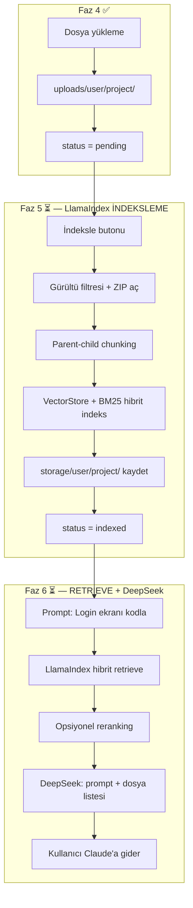

# ContextCraft — Cursor Proje Rehberi

## Proje Özeti

**ContextCraft**, yazılımcıların projelerini yükleyip **LlamaIndex** ile indeksleyen; ardından **DeepSeek** (OpenRouter) ile kullanıcının kısa isteğini **detaylandırılmış, dış AI araçlarına (Claude, ChatGPT) uyumlu bir prompt** haline getiren ve **yalnızca gerekli dosyaları** seçen bir token optimizasyon platformudur.

> **Önemli:** ContextCraft bir sohbet uygulaması **değildir**. Kullanıcı burada AI ile konuşmaz; sistem prompt üretir ve hangi dosyaların yeterli olduğunu söyler. Asıl kodlama Claude / ChatGPT gibi araçlarda yapılır.

### Örnek Akış

```
Kullanıcı yazar:  "Login ekranı kodla"
         ↓
LlamaIndex:       Hibrit arama ile ilgili dosya/parçaları bulur (Faz 5 indeks + Faz 6 retrieve)
         ↓
DeepSeek:         Bulunan parçaları değerlendirir (Faz 6)
         ↓
Sistem çıktısı:
  1) Detaylandırılmış prompt  →  Claude'a yapıştırılacak metin
  2) Gerekli dosyalar         →  "Claude'a app/auth/routes.py ve login.html atman yeterli"
```

- **Ders:** İnternet Programcılığı (Meslek Yüksek Okulu)
- **Framework:** Flask 3.x
- **Python:** 3.9 (sistem Python — Mac uyumluluğu için)
- **Veritabanı:** SQLite (geliştirme)
- **Bağlam Motoru:** LlamaIndex (indeksleme + hibrit retrieval)
- **Prompt Değerlendirici:** OpenRouter → DeepSeek (model — **henüz seçilmedi**, Faz 6)
- **Hedef dış AI araçları:** Claude, ChatGPT

---

## Şu An Hangi Aşamadayız?

**Faz 5 planlandı — kodlamaya hazır, henüz başlanmadı**

| Bölüm | Durum |
|---|---|
| Faz 1–3: İskelet, DB, Auth | ✅ Tamamlandı |
| Faz 4: Proje yönetimi | ✅ Tamamlandı |
| Faz 5 prep: API key altyapısı (`LLAMAINDEX_*`, `STORAGE_FOLDER`) | ✅ Tamamlandı |
| Faz 5: LlamaIndex indeksleme | ⏳ Planlandı, kod bekliyor |
| Faz 6: Prompt optimizasyon (DeepSeek) | ⏳ Ertelendi — model seçimi yeni sohbette |
| Faz 7: `openrouter.py` altyapısı | ✅ Hazır (entegrasyon Faz 6'da) |
| Faz 8: Prompt arayüzü | ⏳ Bekliyor |
| Faz 9: UI & teslim | ⏳ Bekliyor |

---

## Bekleyen Kararlar (yeni sohbette)

> Bu maddeler bilinçli olarak ertelendi. **Onay alınmadan AI/model eklenmeyecek.**

| Konu | Durum | Not |
|---|---|---|
| **Embedding modeli** (Faz 5) | ⏸ Ertelendi | `LLAMAINDEX_EMBEDDING_MODEL` — yeni sohbette karar verilecek |
| **DeepSeek modeli** (Faz 6) | ⏸ Ertelendi | V3.1 veya başka sürüm — Faz 6'ya gelince seçilecek |
| **Reranking** (Faz 6) | ⏸ Tartışıldı | Opsiyonel; Faz 6'da `RERANK_ENABLED=false` ile eklenebilir |
| **Faz 5.1 kodlama** | ⏳ Bekliyor | Onay sonrası başlanacak |

---

## Proje Adımları (Yol Haritası)

### Faz 1 — Temel Altyapı ✅

| # | Adım | Durum |
|---|---|---|
| 1.1 | Application Factory + Blueprint mimarisi | ✅ |
| 1.2 | `extensions.py` (db, migrate, login, csrf) | ✅ |
| 1.3 | `.env`, `.gitignore`, `requirements.txt` | ✅ |
| 1.4 | `config.py` (Development / Production / Testing) | ✅ |

### Faz 2 — Veritabanı ✅

| # | Adım | Durum |
|---|---|---|
| 2.1 | `User` modeli (SQLAlchemy 2.x, werkzeug hash) | ✅ |
| 2.2 | `Project` modeli (owner ilişkisi, status, source_path) | ✅ |
| 2.3 | Python 3.9 uyumu (`Optional[str]`) | ✅ |
| 2.4 | `flask db init` + migrate + upgrade | ✅ |

### Faz 3 — Kimlik Doğrulama ✅

| # | Adım | Durum |
|---|---|---|
| 3.1 | `RegisterForm` / `LoginForm` (Flask-WTF + CSRF) | ✅ |
| 3.2 | `/auth/register`, `/auth/login`, `/auth/logout` | ✅ |
| 3.3 | E-posta ile giriş, "Beni hatırla" | ✅ |
| 3.4 | `user_loader` + Türkçe flash mesajları | ✅ |
| 3.5 | `base.html` + minimal anasayfa | ✅ |

### Faz 4 — Proje Yönetimi ✅

| # | Adım | Durum |
|---|---|---|
| 4.1 | Upload altyapısı (`file_helpers.py`, `config.py`) | ✅ |
| 4.2 | `ProjectForm` (MultipleFileField, çoklu dosya) | ✅ |
| 4.3 | `/core/projects/new` — proje oluşturma | ✅ |
| 4.4 | `/core/projects` — proje listesi | ✅ |
| 4.5 | Proje detay + silme (disk temizliği) | ✅ |

**Faz 4 notları:**
- ZIP zorunluluğu yok; `.py`, `.html`, `.js`, `.zip` vb. tek tek yüklenebilir
- Varsayılan dosya boyutu limiti yok (`.env` ile opsiyonel `MAX_CONTENT_LENGTH`)
- Dosya yolu: `uploads/{user_id}/{project_id}/`

### Faz 5 — LlamaIndex İndeksleme ⏳ (planlandı)

| # | Adım | Durum |
|---|---|---|
| 5.1 | Config + `storage/` + gürültü filtresi + ZIP açma | ⏳ |
| 5.2 | `llamaindex_service.py` — `build_index()` | ⏳ |
| 5.3 | Parent-child chunking + metadata zenginleştirme | ⏳ |
| 5.4 | Hibrit indeks (VectorStore + BM25) | ⏳ |
| 5.5 | `retrieve(project, prompt)` fonksiyonu | ⏳ |
| 5.6 | UI: "İndeksle" butonu + status güncelleme | ⏳ |
| 5.7 | Silme / yeniden indeksleme temizliği | ⏳ |

**Onaylanan Faz 5 mimari kararları:**
- ✅ Hibrit retrieval (vektör + BM25)
- ✅ Parent-child chunking (parent = dosya bağlamı, child = fonksiyon/blok)
- ✅ Gürültü filtresi (`venv/`, `__pycache__/`, `node_modules/` atlanır)
- ✅ Metadata: `file_path`, `symbol_name`, satır no, dosya tipi
- ❌ Onaysız AI/embedding modeli eklenmez

**Status değerleri:** `pending` → `indexed` / `failed`

### Faz 6 — Prompt Optimizasyon Motoru ⏳ (ertelendi)

| # | Adım | Durum |
|---|---|---|
| 6.1 | `prompt_optimizer.py` — orkestrasyon | ⏳ |
| 6.2 | LlamaIndex retrieval → DeepSeek | ⏳ |
| 6.3 | Detaylandırılmış prompt üretme | ⏳ |
| 6.4 | Gerekli dosya listesi üretme | ⏳ |
| 6.5 | Çıktı: `{ optimized_prompt, required_files, explanation }` | ⏳ |
| 6.6 | Opsiyonel reranking (`RERANK_ENABLED=false`) | ⏸ Karar bekliyor |
| 6.7 | DeepSeek model seçimi | ⏸ **Yeni sohbette karar verilecek** |

### Faz 7 — DeepSeek Altyapısı 🔶

| # | Adım | Durum |
|---|---|---|
| 7.1 | `app/services/openrouter.py` — `DeepSeekClient` | ✅ |
| 7.2 | `config.py` + `.env` OpenRouter ayarları | ✅ |
| 7.3 | `get_deepseek_client()` factory fonksiyonu | ✅ |
| 7.4 | Prompt optimizer'a entegrasyon | ⏳ Faz 6 |

### Faz 8 — Prompt Arayüzü ⏳

| # | Adım | Durum |
|---|---|---|
| 8.1 | Proje detayında prompt giriş formu | ⏳ |
| 8.2 | Sonuç ekranı: detaylandırılmış prompt (kopyala) | ⏳ |
| 8.3 | Gerekli dosya listesi + açıklama | ⏳ |
| 8.4 | Token tasarrufu bilgisi | ⏳ |

> Sohbet arayüzü **yapılmayacak**.

### Faz 9 — Arayüz & Teslim ⏳

| # | Adım | Durum |
|---|---|---|
| 9.1 | Bootstrap veya Tailwind | ⏳ |
| 9.2 | Responsive dashboard | ⏳ |
| 9.3 | Birim testleri | ⏳ |
| 9.4 | Production config + sunum dokümantasyonu | ⏳ |

---

## Sistem Mimarisi (LlamaIndex nerede?)



### Rol dağılımı

| Bileşen | Ne zaman | Ne yapar |
|---|---|---|
| **Flask (core)** | Faz 4 | Dosyaları diske kaydeder |
| **LlamaIndex** | Faz 5 | İndeksler (bir kez) |
| **LlamaIndex** | Faz 6 | Retrieve — ilgili parçaları getirir (her prompt) |
| **DeepSeek** | Faz 6 | Parçaları okuyup detaylı prompt + dosya seçimi yazar |
| **Claude/ChatGPT** | Dışarıda | Asıl kodlama |

---

## Klasör Yapısı (güncel)

```
ContextCraft/
├── app/
│   ├── auth/                   ✅
│   ├── core/
│   │   ├── forms.py            ✅ ProjectForm
│   │   └── routes.py           ✅ proje CRUD
│   ├── main/                   ✅
│   ├── models/                 ✅
│   ├── services/
│   │   ├── openrouter.py       ✅ (Faz 6'da kullanılacak)
│   │   ├── llamaindex_service.py  ⏳ Faz 5
│   │   └── prompt_optimizer.py    ⏳ Faz 6
│   ├── templates/core/
│   │   ├── project_form.html   ✅
│   │   ├── project_list.html   ✅
│   │   └── project_detail.html ✅
│   └── utils/
│       └── file_helpers.py     ✅
├── uploads/                    gitignore
├── storage/                    gitignore — Faz 5 indeks dosyaları
├── config.py
├── cursor.md
├── .env                        gitignore — API anahtarları burada
└── .env.example                şablon — repoda kalır
```

---

## Ortam Değişkenleri

```env
# Faz 5 — LlamaIndex embedding (SİZ dolduracaksınız)
LLAMAINDEX_API_KEY=
LLAMAINDEX_API_BASE=https://openrouter.ai/api/v1
LLAMAINDEX_EMBEDDING_MODEL=          # ← YENİ SOHBETTE KARAR VERİLECEK

# Faz 6 — DeepSeek (SİZ dolduracaksınız)
OPENROUTER_API_KEY=
OPENROUTER_MODEL=                    # ← FAZ 6'DA SEÇİLECEK (örn. deepseek-v3.1)

# Opsiyonel
# MAX_CONTENT_LENGTH=
# RERANK_ENABLED=false               # Faz 6 — henüz eklenmedi
```

> `.env` dosyası `.gitignore`'da — **GitHub'a asla gitmez.**

---

## Kodlama Kuralları (Cursor için)

### Python sürümü
- Hedef: **Python 3.9** — `str | None` kullanma, `Optional[str]` kullan

### Mimari
- LlamaIndex → `llamaindex_service.py`
- DeepSeek → `openrouter.py`
- Orkestrasyon → `prompt_optimizer.py`
- **Onaysız AI/model/embedding ekleme**

### Güvenlik
- API anahtarları yalnızca `.env`'de
- `secure_filename`, path traversal koruması, CSRF aktif

### İş akışı
- Büyük değişikliklerde önce **plan göster**, onay al, sonra kod yaz
- Her faz adım adım, ayrı onay

---

## Mevcut Rotalar

| URL | Blueprint | Açıklama |
|---|---|---|
| `/` | main | Anasayfa |
| `/auth/register` | auth | Kayıt ol |
| `/auth/login` | auth | Giriş yap |
| `/auth/logout` | auth | Çıkış yap |
| `/core/projects` | core | Proje listesi |
| `/core/projects/new` | core | Yeni proje |
| `/core/projects/<id>` | core | Proje detay |
| `/core/projects/<id>/delete` | core | Proje sil (POST) |

---

## Yeni Sohbet İçin Başlangıç Promptu

```
ContextCraft projesinde Faz 5'e devam ediyorum.
cursor.md dosyasını oku.
Embedding modeli ve DeepSeek modeli henüz seçilmedi — onaysız ekleme.
Faz 5.1'i planla ve onay bekle.
```
