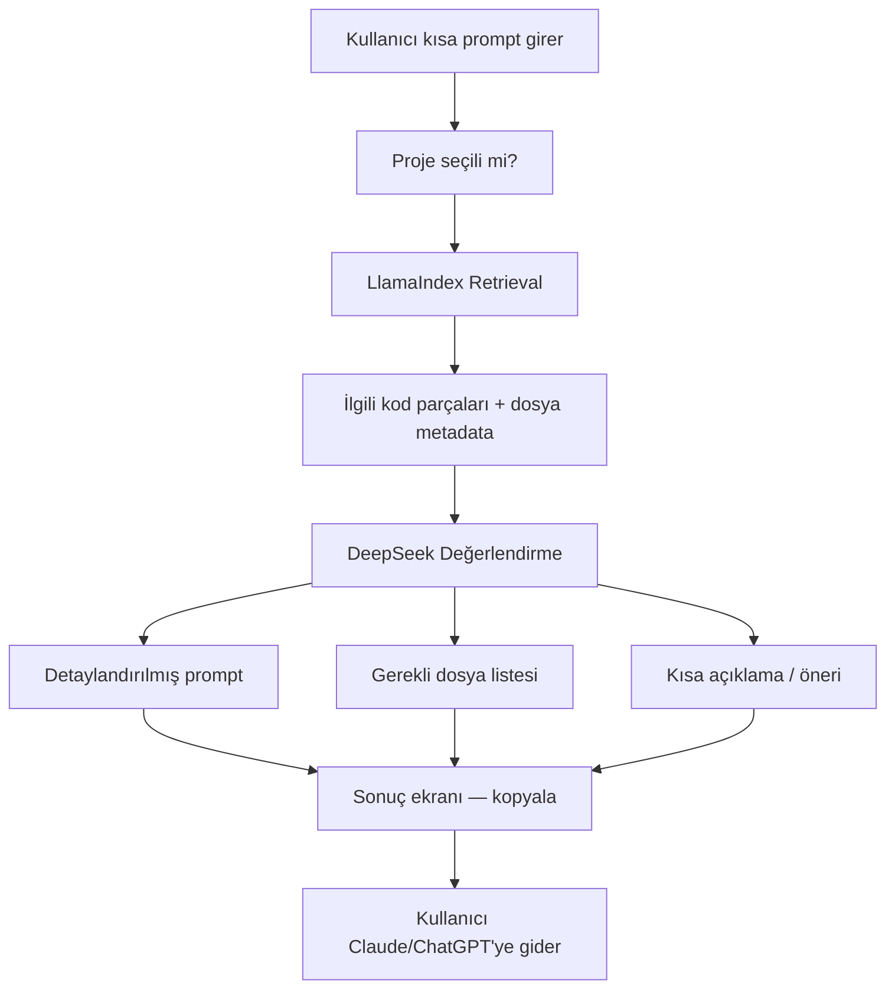

# ContextCraft — Cursor Proje Rehberi

## Proje Özeti

**ContextCraft**, yazılımcıların projelerini yükleyip **LlamaIndex** ile indeksleyen; ardından **DeepSeek** (OpenRouter) ile kullanıcının kısa isteğini **detaylandırılmış, dış AI araçlarına (Claude, ChatGPT) uyumlu bir prompt** haline getiren ve **yalnızca gerekli dosyaları** seçen bir token optimizasyon platformudur.

> **Önemli:** ContextCraft bir sohbet uygulaması **değildir**. Kullanıcı burada AI ile konuşmaz; sistem prompt üretir ve hangi dosyaların yeterli olduğunu söyler. Asıl kodlama Claude / ChatGPT gibi araçlarda yapılır.

### Örnek Akış

```
Kullanıcı yazar:  "Login ekranı kodla"
         ↓
LlamaIndex:       Projeyi tarar, auth/login ile ilgili dosya ve kod parçalarını bulur
         ↓
DeepSeek:         LlamaIndex verisini değerlendirir
         ↓
Sistem çıktısı:
  1) Detaylandırılmış prompt  →  Claude'a yapıştırılacak metin
  2) Gerekli dosyalar         →  "Claude'a app/auth/routes.py ve login.html atman yeterli"
```

- **Ders:** İnternet Programcılığı (Meslek Yüksek Okulu)
- **Framework:** Flask 3.x
- **Python:** 3.9 (sistem Python — Mac uyumluluğu için)
- **Veritabanı:** SQLite (geliştirme)
- **Bağlam Motoru:** LlamaIndex (indeksleme + ilgili parça/dosya bulma)
- **Prompt Değerlendirici:** OpenRouter → DeepSeek (`deepseek/deepseek-chat`)
- **Hedef dış AI araçları:** Claude, ChatGPT (ContextCraft bunların yerine geçmez)

---

## Şu An Hangi Aşamadayız?

**Aşama 5 / 11 — Auth tamamlandı, DeepSeek altyapısı hazır; asıl iş akışı henüz kurulmadı**

| Bölüm | Durum |
|---|---|
| Proje iskeleti (factory + blueprint) | ✅ Tamamlandı |
| User & Project modelleri | ✅ Tamamlandı |
| Veritabanı migration | ✅ Tamamlandı |
| Kayıt / Giriş / Çıkış (auth) | ✅ Tamamlandı |
| Anasayfa (main) | ✅ Minimal tamamlandı |
| OpenRouter / DeepSeek servis katmanı | ✅ Altyapı monte edildi |
| Proje yükleme (core) | ⏳ Henüz başlanmadı |
| LlamaIndex indeksleme | ⏳ Henüz başlanmadı |
| Prompt optimizasyon motoru | ⏳ Henüz başlanmadı |
| Dosya seçim önerisi | ⏳ Henüz başlanmadı |
| Dashboard & prompt arayüzü | ⏳ Henüz başlanmadı |
| Test & teslim | ⏳ Henüz başlanmadı |

---

## Proje Adımları (Yol Haritası)

### Faz 1 — Temel Altyapı ✅

| # | Adım | Durum |
|---|---|---|
| 1.1 | Application Factory + Blueprint mimarisi | ✅ |
| 1.2 | `extensions.py` (db, migrate, login, csrf) | ✅ |
| 1.3 | `.env`, `.gitignore`, `requirements.txt` | ✅ |
| 1.4 | `config.py` (Development / Production / Testing) | ✅ |

### Faz 2 — Veritabanı ✅

| # | Adım | Durum |
|---|---|---|
| 2.1 | `User` modeli (SQLAlchemy 2.x, werkzeug hash) | ✅ |
| 2.2 | `Project` modeli (owner ilişkisi, status, source_path) | ✅ |
| 2.3 | Python 3.9 uyumu (`Optional[str]`) | ✅ |
| 2.4 | `flask db init` + migrate + upgrade | ✅ |

### Faz 3 — Kimlik Doğrulama ✅

| # | Adım | Durum |
|---|---|---|
| 3.1 | `RegisterForm` / `LoginForm` (Flask-WTF + CSRF) | ✅ |
| 3.2 | `/auth/register`, `/auth/login`, `/auth/logout` | ✅ |
| 3.3 | E-posta ile giriş, "Beni hatırla" | ✅ |
| 3.4 | `user_loader` + Türkçe flash mesajları | ✅ |
| 3.5 | `base.html` + minimal anasayfa | ✅ |

### Faz 4 — Proje Yönetimi ⏳

| # | Adım | Durum |
|---|---|---|
| 4.1 | Proje oluşturma formu | ⏳ |
| 4.2 | Dosya/klasör yükleme (`secure_filename`) | ⏳ |
| 4.3 | `uploads/` dizin yönetimi | ⏳ |
| 4.4 | Kullanıcıya özel proje listesi (dashboard) | ⏳ |
| 4.5 | Proje detay, silme | ⏳ |

### Faz 5 — LlamaIndex İndeksleme ⏳

| # | Adım | Durum |
|---|---|---|
| 5.1 | `app/services/llamaindex_service.py` — proje indeksleme | ⏳ |
| 5.2 | Yüklenen dosyaları parçalara ayırma (chunking) | ⏳ |
| 5.3 | `Project.status` güncelleme (`pending` → `indexed` / `failed`) | ⏳ |
| 5.4 | Kullanıcı promptuna göre ilgili kod parçalarını getirme (retrieval) | ⏳ |
| 5.5 | İndeks dosyalarını proje bazında saklama | ⏳ |

### Faz 6 — Prompt Optimizasyon Motoru ⏳

| # | Adım | Durum |
|---|---|---|
| 6.1 | `app/services/prompt_optimizer.py` — ana orkestrasyon servisi | ⏳ |
| 6.2 | LlamaIndex retrieval çıktısını DeepSeek'e iletme | ⏳ |
| 6.3 | DeepSeek'ten **detaylandırılmış prompt** üretme | ⏳ |
| 6.4 | DeepSeek'ten **gerekli dosya listesi** üretme | ⏳ |
| 6.5 | Çıktıyapısı: `{ optimized_prompt, required_files, explanation }` | ⏳ |
| 6.6 | DeepSeek system prompt'u: "Sohbet etme, prompt yaz ve dosya seç" | ⏳ |

### Faz 7 — DeepSeek Altyapısı 🔶

| # | Adım | Durum |
|---|---|---|
| 7.1 | `app/services/openrouter.py` — `DeepSeekClient` | ✅ |
| 7.2 | `config.py` + `.env` OpenRouter ayarları | ✅ |
| 7.3 | `get_deepseek_client()` factory fonksiyonu | ✅ |
| 7.4 | Prompt optimizer'a entegrasyon | ⏳ |

### Faz 8 — Prompt Arayüzü ⏳

| # | Adım | Durum |
|---|---|---|
| 8.1 | Proje detay sayfasında prompt giriş formu | ⏳ |
| 8.2 | Sonuç ekranı: detaylandırılmış prompt (kopyala butonu) | ⏳ |
| 8.3 | Sonuç ekranı: gerekli dosya listesi + açıklama | ⏳ |
| 8.4 | Token tasarrufu bilgisi (kaç dosya atlandı) | ⏳ |

> **Not:** Sohbet arayüzü **yapılmayacak**. Tek yönlü prompt → sonuç akışı.

### Faz 9 — Arayüz & Teslim ⏳

| # | Adım | Durum |
|---|---|---|
| 9.1 | Bootstrap veya Tailwind entegrasyonu | ⏳ |
| 9.2 | Responsive dashboard tasarımı | ⏳ |
| 9.3 | Birim testleri (prompt optimizer, file selection) | ⏳ |
| 9.4 | Production config + sunum dokümantasyonu | ⏳ |

---

## Sistem Mimarisi



### Rol dağılımı

| Bileşen | Görevi | Yapmaz |
|---|---|---|
| **LlamaIndex** | Projeyi indeksler, prompta göre ilgili dosya/parçaları bulur | Prompt yazmaz, sohbet etmez |
| **DeepSeek** | LlamaIndex verisini analiz eder; detaylı prompt + dosya seçimi üretir | Kod yazmaz, sohbet etmez |
| **ContextCraft UI** | Prompt alır, sonucu gösterir, kopyalamayı kolaylaştırır | AI cevabı üretmez |
| **Claude / ChatGPT** | Kullanıcı optimize prompt + seçili dosyalarla asıl işi yapar | — |

---

## Örnek Senaryo

**Girdi (kullanıcı):**
```
Login ekranı kodla
```

**LlamaIndex bulur:**
- `app/auth/routes.py` — login rotası
- `app/auth/forms.py` — LoginForm
- `app/templates/auth/login.html` — mevcut şablon
- `app/models/user.py` — User modeli

**DeepSeek çıktısı:**

```json
{
  "optimized_prompt": "Flask-WTF LoginForm kullanarak /auth/login rotası için giriş ekranı oluştur. E-posta + şifre alanları, CSRF koruması, 'Beni hatırla' checkbox'ı ve Türkçe hata mesajları olsun. Mevcut User modelindeki check_password metodunu kullan.",
  "required_files": [
    "app/auth/routes.py",
    "app/templates/auth/login.html"
  ],
  "explanation": "Claude'a routes.py ve login.html dosyalarını atman yeterli. forms.py ve user.py zaten mevcut yapıda tanımlı; tekrar göndermene gerek yok."
}
```

**Kullanıcı:** Bu promptu ve 2 dosyayı Claude'a yapıştırır → token israfı önlenir.

---

## Planlanan Servis Katmanı

```
app/services/
├── __init__.py
├── openrouter.py          ✅ DeepSeekClient (OpenRouter HTTP istemcisi)
├── llamaindex_service.py  ⏳ indeksleme + retrieval
└── prompt_optimizer.py    ⏳ LlamaIndex + DeepSeek orkestrasyonu
```

### `prompt_optimizer.py` taslağı (henüz yazılmadı)

```python
def optimize_prompt(project_id: int, user_prompt: str) -> dict:
    """
    Döndürür:
    {
        "optimized_prompt": str,   # Claude/ChatGPT'ye yapıştırılacak metin
        "required_files": list,    # Gönderilmesi gereken dosya yolları
        "explanation": str,        # "X dosyasını atman yeterli" açıklaması
        "skipped_files": list,     # Atlanan dosyalar (token tasarrufu)
    }
    """
```

### DeepSeek system prompt (planlanan)

DeepSeek'e verilecek sistem mesajı kabaca şöyle olacak:

> Sen bir prompt mühendisisin. Sana LlamaIndex'ten gelen proje bağlamı ve kullanıcının kısa isteği verilecek. Görevin: (1) Claude veya ChatGPT'ye yapıştırılabilecek detaylı bir prompt yazmak, (2) yalnızca gerekli dosyaları seçmek, (3) kısa bir açıklama yapmak. Sohbet etme, kod yazma.

---

## Klasör Yapısı (güncel + planlanan)

```
ContextCraft/
├── app/
│   ├── __init__.py
│   ├── extensions.py
│   ├── services/
│   │   ├── __init__.py
│   │   ├── openrouter.py           ✅
│   │   ├── llamaindex_service.py   ⏳
│   │   └── prompt_optimizer.py     ⏳
│   ├── auth/
│   ├── core/                       ⏳ proje yükleme + prompt arayüzü
│   ├── main/
│   ├── models/
│   ├── templates/
│   │   ├── core/
│   │   │   ├── project_list.html   ⏳
│   │   │   ├── project_detail.html ⏳
│   │   │   └── prompt_result.html  ⏳
│   └── static/
├── uploads/                        ⏳ gitignore'da
├── storage/                        ⏳ LlamaIndex indeks dosyaları
├── migrations/
├── config.py
├── run.py
├── cursor.md
├── .env
└── .env.example
```

---

## Kodlama Kuralları (Cursor için)

### Python sürümü
- Hedef: **Python 3.9** — `str | None` kullanma, `Optional[str]` kullan

### Mimari
- LlamaIndex mantığı → `llamaindex_service.py`
- DeepSeek çağrıları → `openrouter.py`
- İkisini birleştiren akış → `prompt_optimizer.py`
- Rotalarda iş mantığı yazma; servisleri çağır

### AI kuralları
- ContextCraft **sohbet botu değildir** — chat endpoint'i ekleme
- Ham proje dosyalarının tamamını DeepSeek'e gönderme; önce LlamaIndex retrieval
- DeepSeek çıktısı yapılandırılmış JSON veya parse edilebilir formatta olmalı
- `OPENROUTER_API_KEY` repoya gitmez

### Güvenlik
- Şifreler hashlenir, CSRF aktif, `secure_filename` ile dosya yükleme

### İş akışı
- Büyük değişikliklerde önce **plan göster**, onay al, sonra kod yaz

---

## Bağımlılıklar

```
flask>=3.0,<4.0
flask-sqlalchemy>=3.1,<4.0
flask-migrate>=4.0,<5.0
flask-login>=0.6,<1.0
flask-wtf>=1.2,<2.0
email-validator>=2.0,<3.0
python-dotenv>=1.0,<2.0
llama-index>=0.10,<1.0
werkzeug>=3.0,<4.0
```

---

## OpenRouter / DeepSeek Yapılandırması

```env
OPENROUTER_API_KEY=sk-or-v1-...
OPENROUTER_MODEL=deepseek/deepseek-chat
OPENROUTER_SITE_URL=http://localhost:5000
OPENROUTER_APP_NAME=ContextCraft
```

API anahtarı: [https://openrouter.ai/keys](https://openrouter.ai/keys)

| Model ID | Kullanım |
|---|---|
| `deepseek/deepseek-chat` | Prompt detaylandırma + dosya seçimi (varsayılan) |
| `deepseek/deepseek-r1` | Karmaşık mimari kararlar için alternatif |

---

## Çalıştırma

```bash
cd ContextCraft
source venv/bin/activate
pip install -r requirements.txt
python run.py
```

---

## Mevcut Rotalar

| URL | Blueprint | Açıklama |
|---|---|---|
| `/` | main | Anasayfa |
| `/auth/register` | auth | Kayıt ol |
| `/auth/login` | auth | Giriş yap |
| `/auth/logout` | auth | Çıkış yap |

---

## Sonraki Cursor Oturumu İçin Öneri

> "Faz 4: Core blueprint'e proje yükleme akışını ekle. Plan modunda ilerle."

Ardından:

> "Faz 5: LlamaIndex indeksleme servisini yaz."

Son olarak:

> "Faz 6: prompt_optimizer.py — LlamaIndex + DeepSeek ile prompt detaylandırma ve dosya seçimi."
