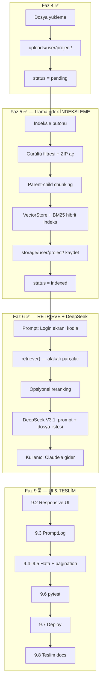

# ContextCraft — Cursor Proje Rehberi

## Proje Özeti

**ContextCraft**, yazılımcıların projelerini yükleyip **LlamaIndex** ile indeksleyen; ardından **DeepSeek V3.1** (OpenRouter) ile kullanıcının kısa isteğini **detaylandırılmış, dış AI araçlarına (Claude, ChatGPT) uyumlu bir prompt** haline getiren ve **yalnızca gerekli dosyaları** seçen bir token optimizasyon platformudur.

> **Önemli:** ContextCraft bir sohbet uygulaması **değildir**. Kullanıcı burada AI ile konuşmaz; sistem prompt üretir ve hangi dosyaların yeterli olduğunu söyler. Asıl kodlama Claude / ChatGPT gibi araçlarda yapılır.

> **Önemli:** Hiçbir AI modeli **yerel indirilmez**. Embedding ve LLM istekleri yalnızca **OpenRouter API** üzerinden gider.

### Örnek Akış (Faz 6+8 ✅)

```
Kullanıcı yazar:  "Login ekranı kodla"
         ↓
LlamaIndex:       Hibrit arama ile ilgili dosya/parçaları bulur (Faz 5 ✅)
         ↓
DeepSeek V3.1:    Bulunan parçaları değerlendirir (Faz 6 ✅)
         ↓
Sistem çıktısı:
  1) Detaylandırılmış prompt  →  Claude'a yapıştırılacak metin
  2) Gerekli dosyalar         →  örn. yalnızca all_in_one_auth.py
```

- **Ders:** İnternet Programcılığı (Meslek Yüksek Okulu)
- **Framework:** Flask 3.x
- **Python:** 3.9 (sistem Python — Mac uyumluluğu için)
- **Veritabanı:** SQLite (geliştirme)
- **Bağlam Motoru:** LlamaIndex 0.11.x (indeksleme + hibrit retrieval)
- **Prompt Değerlendirici:** OpenRouter → DeepSeek V3.1 (`deepseek/deepseek-chat-v3.1`)
- **Embedding:** OpenRouter → `text-embedding-3-small` (API üzerinden)
- **Hedef dış AI araçları:** Claude, ChatGPT

---

## Şu An Hangi Aşamadayız?

**Faz 1–8 tamamlandı — Faz 9 (UI & teslim) başlıyor**

| Bölüm | Durum |
|---|---|
| Faz 1–3: İskelet, DB, Auth | ✅ Tamamlandı |
| Faz 4: Proje yönetimi | ✅ Tamamlandı |
| Faz 5: LlamaIndex indeksleme | ✅ Tamamlandı (test edildi) |
| Faz 6: Prompt optimizasyon (DeepSeek V3.1) | ✅ Tamamlandı |
| Faz 7: `openrouter.py` altyapısı | ✅ Tamamlandı |
| Faz 8: Prompt arayüzü | ✅ Tamamlandı |
| Faz 9: UI & teslim | ⏳ **Aktif** — 9.1 ✅, 9.2 ✅, sıradaki: **9.3** |

**Teslim:** 01/06/2026 13:00 — GitHub (public) + GUZEM zip  
**Hoca dokümanı:** `BLG106_FinalProje.pdf` (proje kökünde)

### Faz 9 iş akışı (zorunlu)

```
Her adım:
  1) Plan göster → senin onayın
  2) Kod yaz + test et
  3) cursor.md güncelle
  4) git commit (anlamlı mesaj, tek adım = tek commit)
  5) (isteğe bağlı) push
```

> PDF §4.5: en az **15 anlamlı commit** hedeflenir. Her Faz 9 adımı ayrı commit olmalı.

**Kullanıcı şu an ne yapabilir?**
- Kayıt / giriş ✅
- Proje oluşturma, dosya yükleme ✅
- Proje indeksleme ✅ (`status = indexed`)
- Prompt yazma + optimize ✅
- Detaylandırılmış prompt + kopyala ✅
- Gerekli dosya listesi (yalnızca alakalı dosyalar) ✅
- Token tasarrufu bilgisi ✅

---

## Bu Oturumda Yapılanlar (Mayıs 2026)

### 1. Model kararları kilitlendi ✅

| Konu | Karar | Değer |
|---|---|---|
| **Embedding** (Faz 5) | OpenRouter API — yerel model yok | `text-embedding-3-small` |
| **DeepSeek LLM** (Faz 6) | DeepSeek V3.1 | `deepseek/deepseek-chat-v3.1` |
| **Reranking** (Faz 6) | Opsiyonel, varsayılan kapalı | `RERANK_ENABLED=false` |
| **Retrieve aday sayısı** | Hibrit retrieve → top 10 | rerank açıksa → top 5 |

### 2. Faz 5 kodlandı ✅

Yeni dosyalar:
- `app/utils/index_helpers.py` — gürültü filtresi, ZIP açma, `storage/` yardımcıları
- `app/services/llamaindex_service.py` — indeksleme, hibrit retrieve

Güncellenen dosyalar:
- `app/core/routes.py` — `POST /projects/<id>/index`, silmede storage temizliği
- `app/templates/core/project_detail.html` — İndeksle / Yeniden İndeksle butonu
- `app/templates/base.html` — status badge renkleri
- `config.py`, `.env.example`, `requirements.txt`

### 3. Bilinen hatalar ve düzeltmeler ✅

| Hata | Sebep | Çözüm |
|---|---|---|
| `hashlib.scrypt` yok (kayıt) | Werkzeug 3 varsayılanı scrypt; macOS Python 3.9 LibreSSL desteklemiyor | `user.py`: `method="pbkdf2:sha256"` (hâlâ werkzeug hash) |
| İndeksleme patlıyor | `.env`'de `openai/text-embedding-3-small` — LlamaIndex enum tanımıyor | `_normalize_embedding_model()` ile `text-embedding-3-small`'a çevir |
| LlamaIndex import hatası | llama-index 0.14 Python 3.10+ gerektirir | `requirements.txt`: `llama-index>=0.11.23,<0.12.0` |
| Prompt oluşturma patlıyor | `QueryFusionRetriever` varsayılan OpenAI LLM arıyor | `MockLLM()` — `num_queries=1`, LLM çağrısı yok |
| OpenRouter 401 User not found | Geçersiz veya eksik API anahtarı | `.env` anahtarını kontrol et; `LLAMAINDEX_API_KEY` boşsa `OPENROUTER_API_KEY` kullanılır |

### 4. Test sonuçları ✅

- Kayıt/giriş: pbkdf2 düzeltmesi sonrası çalışıyor
- İndeksleme: 8 dosyalı test projesi → 28 node, `status = indexed`
- Embedding: OpenRouter API üzerinden 1536 boyutlu vektör döndü

### 5. Adım 6.1 — prompt_optimizer iskeleti ✅

- `app/services/prompt_optimizer.py` oluşturuldu
- `PromptOptimizeError` exception sınıfı
- `optimize_prompt(project, user_prompt)` imzası
- Ön kontroller: boş prompt, `status != indexed`, `OPENROUTER_API_KEY` yok

### 6. Adım 6.2 — retrieve entegrasyonu ✅

- `retrieve(project, prompt)` çağrısı eklendi
- `_retrieve_context()` — IndexBuildError → PromptOptimizeError dönüşümü
- Boş retrieve sonucu için anlamlı hata mesajı
- `format_retrieved_chunks()` — DeepSeek formatı: `[dosya | sembol | satır X-Y]`

### 7. Adım 6.3 — DeepSeek API çağrısı ✅

- `SYSTEM_PROMPT` — ContextCraft rolü, JSON format zorunluluğu
- `_build_user_message()` — kullanıcı isteği + retrieve edilen parçalar
- `_call_deepseek()` — `temperature=0.3`, `max_tokens=2048`
- `OpenRouterError` → `PromptOptimizeError` dönüşümü

### 8. Adım 6.4–6.5 — yanıt parse ve çıktı formatı ✅

- `_parse_deepseek_response()` — JSON parse + markdown code fence temizliği
- `_normalize_required_files()` — retrieve edilen dosya yollarıyla eşleştirme
- JSON hatasında fallback: ham metin → `optimized_prompt`
- Çıktı: `{ optimized_prompt, required_files, explanation }`

### 9. Adım 8.1 — Prompt formu + route ✅

- `PromptForm` — textarea, 3–2000 karakter, CSRF korumalı
- `POST /projects/<id>/optimize` — `optimize_prompt()` çağrısı
- `project_detail.html` — indekslenmiş projelerde prompt formu
- `pending` / `failed` → "Önce indeksleyin" mesajı

### 10. Adım 8.2 — Detaylandırılmış prompt + kopyala ✅

- Sonuç bölümü: readonly textarea (`result.optimized_prompt`)
- "Kopyala" butonu — `navigator.clipboard` + `execCommand` fallback
- "Kopyalandı!" geri bildirimi (2 sn)
- `main-wide` — proje detay sayfası genişliği 720px

### 11. Adım 8.3 — Gerekli dosya listesi + açıklama ✅

- `result.required_files` — monospace dosya listesi
- Boş liste → "Dosya önerisi üretilemedi"
- `result.explanation` — Türkçe açıklama paragrafı

### 12. Adım 8.4 — Token tasarrufu bilgisi ✅

- `optimize_prompt()` çıktısına `retrieved_count` ve `total_files` eklendi
### 13. Adım 9.1 — Bootstrap 5 altyapısı ✅

- Bootstrap 5.3 CDN (`base.html`)
- `app/static/css/custom.css` — ContextCraft renkleri + Faz 8 bileşen stilleri
- Responsive navbar (`navbar-expand-lg`, mobil hamburger menü)
- Flash mesajları → Bootstrap `alert` (kapatılabilir)
- Inline CSS kaldırıldı
- Hoca PDF madde #9: Bootstrap kullanımı başlatıldı

### 14. Dosya seçimi düzeltmesi (Faz 6 iyileştirme) ✅

- `llamaindex_service.py` — retrieve dosya çeşitliliği (max 4 dosya, dosya başına max 2 parça)
- `prompt_optimizer.py` — anahtar kelime skorlaması, min. dosya seçimi, max 3 `required_files`
- Test: "login ekranı yap" → 9 dosya yerine yalnızca `all_in_one_auth.py` (veya 1–2 auth dosyası)

---

## Faz 5 — LlamaIndex İndeksleme ✅

### Akış

```
uploads/{user_id}/{project_id}/
    ↓
1. Gürültü filtresi (venv, __pycache__, node_modules atla)
2. ZIP aç → _extracted/{zip_adı}/ (orijinal zip kalır)
3. Parent-child chunking
   Parent  → dosya tamamı (max 12000 karakter)
   Child   → Python: ast ile fonksiyon/sınıf; diğer: 80 satırlık bloklar
4. Metadata: file_path, symbol_name, start_line, end_line, file_type, chunk_type
5. VectorStoreIndex  ─┐
   BM25Retriever     ─┤→ QueryFusionRetriever (reciprocal_rerank)
6. storage/{user_id}/{project_id}/ persist + contextcraft_meta.json
7. status = indexed
```

### Adım tablosu

| # | Adım | Dosya | Durum |
|---|---|---|---|
| 5.1 | Gürültü filtresi + ZIP açma + storage yardımcıları | `index_helpers.py` | ✅ |
| 5.2 | OpenRouter embedding (OpenAIEmbedding + api_base) | `llamaindex_service.py` | ✅ |
| 5.3 | Parent-child chunking + metadata | `llamaindex_service.py` | ✅ |
| 5.4 | Hibrit indeks build | `build_project_index()` | ✅ |
| 5.5 | `retrieve(project, prompt, top_k=10)` | `llamaindex_service.py` | ✅ |
| 5.6 | UI: İndeksle butonu + status | `routes.py`, `project_detail.html` | ✅ |
| 5.7 | Silme / yeniden indeksleme storage temizliği | `routes.py`, `index_helpers.py` | ✅ |

### Status değerleri

`pending` → `indexing` → `indexed` / `failed`

### Önemli fonksiyonlar

```python
# app/services/llamaindex_service.py
build_project_index(project)  # indeksler, node sayısı döner
retrieve(project, prompt)     # top 10 aday listesi — Faz 6'da kullanılacak
IndexBuildError                 # bilinen hatalar (API key yok, dosya yok vb.)
```

### retrieve() çıktı formatı

```python
[
  {
    "score": 0.85,
    "text": "...",
    "file_path": "app/auth/routes.py",
    "symbol_name": "login",
    "start_line": 12,
    "end_line": 28,
    "file_type": "py",
    "chunk_type": "child"
  },
  ...
]
```

---

## Faz 6 — Prompt Optimizasyon Motoru ✅

```
"Login ekranı kodla"
    ↓
retrieve(project, prompt) → top 10 aday  ← backend hazır ✅
    ↓
(opsiyonel reranking → top 5)   ← RERANK_ENABLED=false
    ↓
DeepSeek V3.1 → detaylı prompt + dosya listesi
    ↓
{ optimized_prompt, required_files, explanation }
```

| # | Adım | Durum |
|---|---|---|
| 6.1 | `prompt_optimizer.py` — orkestrasyon | ✅ |
| 6.2 | retrieve → DeepSeek V3.1 | ✅ (retrieve kısmı) |
| 6.3 | Detaylandırılmış prompt üretme | ✅ (DeepSeek çağrısı) |
| 6.4 | Gerekli dosya listesi üretme | ✅ |
| 6.5 | Çıktı: `{ optimized_prompt, required_files, explanation }` | ✅ |
| 6.6 | Opsiyonel reranking | ✅ Karar kilitlendi |
| 6.7 | DeepSeek V3.1 | ✅ Karar kilitlendi |

---

## Faz 7 — DeepSeek Altyapısı ✅

| # | Adım | Durum |
|---|---|---|
| 7.1 | `app/services/openrouter.py` — `DeepSeekClient` | ✅ |
| 7.2 | `config.py` + `.env` OpenRouter ayarları | ✅ |
| 7.3 | `get_deepseek_client()` factory | ✅ |
| 7.4 | Prompt optimizer'a entegrasyon | ✅ |

---

## Faz 8 — Prompt Arayüzü ✅

| # | Adım | Durum |
|---|---|---|
| 8.1 | Proje detayında prompt giriş formu | ✅ |
| 8.2 | Sonuç ekranı: detaylandırılmış prompt (kopyala) | ✅ |
| 8.3 | Gerekli dosya listesi + açıklama | ✅ |
| 8.4 | Token tasarrufu bilgisi | ✅ |

> Sohbet arayüzü **yapılmayacak**.

---

## Faz 9 — Arayüz & Teslim ⏳ (Hibrit Plan — AKTİF)

> **Kaynak:** `cursor.md` orijinal plan + [`BLG106_FinalProje.pdf`](../BLG106_FinalProje.pdf) zorunlu bileşenler + teslim maddeleri.
>
> **İş akışı:** Her adım → **plan + onay** → kod → test → **`cursor.md` güncelle** → **commit** → (push)

### Commit mesaj şablonu (Faz 9)

| Adım | Örnek commit mesajı |
|---|---|
| 9.2 | `feat(ui): responsive Bootstrap dashboard şablonları` |
| 9.3 | `feat(models): PromptLog modeli ve migration` |
| 9.4 | `feat(errors): 404 ve 500 özel hata sayfaları` |
| 9.5 | `feat(core): proje listesi pagination` |
| 9.6 | `test: auth, proje ve prompt_optimizer birim testleri` |
| 9.7 | `chore(deploy): production config ve Docker/Render` |
| 9.8 | `docs: README, rapor ve teslim paketi` |

### Hoca checklist vs proje durumu (PDF §2.1)

| Hoca # | Zorunluluk (PDF §2.1) | Durum | Faz 9 adımı |
|---|---|---|---|
| 1 | Application factory + blueprint | ✅ | — |
| 2 | Jinja2, ≥4 sayfa, template inheritance | ✅ (6+ sayfa) | 9.2 (Bootstrap tamamlama) |
| 3 | Flask-WTF, ≥2 form, CSRF | ✅ | — |
| 4 | SQLAlchemy **≥3 model** + ilişki | ⚠️ User + Project (2) | **9.3** |
| 5 | Flask-Migrate migration | ✅ | 9.3 (PromptLog migration) |
| 6 | Flask-Login, hash'li şifre | ✅ | — |
| 7 | **404 / 500** özel sayfalar | ❌ | **9.4** |
| 8 | Liste sayfalarında **pagination** | ❌ | **9.5** |
| 9 | **Bootstrap** + mobil uyum | ✅ 9.1 + 9.2 | — |
| 10 | Deploy veya Docker | ❌ | **9.7** |

| Teslim (PDF §7) | Durum | Faz 9 adımı |
|---|---|---|
| GitHub repo (≥15 commit) | 🟡 devam ediyor | her adımda commit |
| README.md | 🟡 kısa | **9.8** |
| docs/ai-gunlugu.md (≥7 oturum) | 🟡 devam ediyor | süreç boyunca |
| docs/rapor.md (800–1200 kelime) | ❌ | **9.8** |
| Demo video (3–5 dk) | ❌ | sen kaydedeceksin |
| Canlı URL / docker-compose | ❌ | **9.7** |

### Adım tablosu (hibrit)

| # | Adım | Bizim plan | Hoca PDF | Durum | Commit? |
|---|---|---|---|---|---|
| 9.1 | Bootstrap 5 altyapısı | Bootstrap base | #9 kısmi | ✅ | ✅ |
| 9.2 | Responsive dashboard | Responsive UI | #9 tam + UI/UX 5p | ✅ | ✅ |
| 9.3 | Üçüncü model (`PromptLog`) | 3. model | #4 | ⏳ **sıradaki** | onay sonrası |
| 9.4 | 404 / 500 hata sayfaları | Hata yönetimi | #7 | ⏳ | onay sonrası |
| 9.5 | Proje listesi pagination | Pagination | #8, Prompt 6 | ⏳ | onay sonrası |
| 9.6 | Birim testleri (`pytest`) | Test suite | §4.6, Prompt 9 | ⏳ | onay sonrası |
| 9.7 | Production + dağıtım | Deploy/Docker | #10, dağıtım 5p | ⏳ | onay sonrası |
| 9.8 | Teslim paketi | README + rapor | §7, demo+rapor 10p | ⏳ | onay sonrası |

**Öncelik sırası:** 9.2 → 9.3 → 9.4 → 9.5 → 9.6 → 9.7 → 9.8

**Onay bekleyen kararlar (9.2 öncesi):**
- 3. model: **`PromptLog`** (önerilen) — `optimize_prompt()` sonucunu DB'ye kaydeder
- Deploy (9.7): **Docker** veya **Render/Railway** — 9.7'de seçilecek

---

### 9.1 — Bootstrap 5 altyapısı ✅

**Dosyalar:** `base.html`, `app/static/css/custom.css`

- Bootstrap 5.3 CDN (CSS + JS)
- Responsive navbar (`navbar-expand-lg`, mobil hamburger)
- Flash → Bootstrap `alert` (kapatılabilir)
- Inline CSS kaldırıldı; Faz 8 stilleri `custom.css`'te
- `container-narrow` (480px) / `container-wide` (720px)

---

### 9.2 — Responsive dashboard ✅

**Hoca:** PDF #9 tam, Sunum UI/UX rubrik (5 puan)

**Dosyalar:** 6 şablon + `custom.css`

| Şablon | Yapılan |
|---|---|
| `auth/login.html`, `register.html` | `card`, `form-control`, `form-label`, `btn-primary`, `is-invalid` |
| `main/index.html` | Hero gradient + 3 adımlı akış kartları (yükle → indeksle → prompt) |
| `core/project_list.html` | Bootstrap kart grid, status badge, boş durum |
| `core/project_form.html` | `form-control`, `form-text`, iptal butonu |
| `core/project_detail.html` | Bölümlü kartlar, `list-group`, prompt sonuç alanı, mobil stack |

**custom.css:** Faz 8 override'ları kaldırıldı; marka renkleri + `--bs-primary` override

**Commit:** `feat(ui): responsive Bootstrap dashboard şablonları`

---

### 9.3 — Üçüncü model: `PromptLog` ⏳ **← SIRADAKİ ADIM**

**Hoca:** #4 — en az 3 model + ilişki

**Önerilen şema:**

```
PromptLog
  id, project_id (FK), user_prompt, optimized_prompt
  required_files (JSON/text), explanation, created_at

Project 1──N PromptLog
User 1──N Project (mevcut)
```

**Dosyalar:** `app/models/prompt_log.py`, migration, `optimize_prompt()` sonucunu DB'ye kaydet (opsiyonel: geçmiş listesi UI)

---

### 9.4 — 404 / 500 hata sayfaları ⏳

**Hoca:** #7

**Dosyalar:**
- `app/templates/errors/404.html`, `500.html`
- `app/__init__.py` → `@app.errorhandler(404)`, `@app.errorhandler(500)`

---

### 9.5 — Pagination ⏳

**Hoca:** #8 — liste sayfalarında pagination (PDF Prompt 6: sayfa başı 10)

**Dosyalar:** `core/routes.py`, `project_list.html`

```python
.paginate(page=page, per_page=10, error_out=False)
```

Bootstrap pagination bileşeni.

---

### 9.6 — Birim testleri ⏳

**Bizim plan:** 9.3 (eski numara) | **Hoca:** her özellik için test, Prompt 9

```
tests/
├── conftest.py
├── test_auth.py
├── test_projects.py
├── test_file_helpers.py
└── test_prompt_optimizer.py   # OpenRouter mock
```

**Bağımlılık:** `pytest`, `pytest-flask` (veya conftest fixture)

**Kapsam dışı:** Gerçek OpenRouter/LlamaIndex API çağrısı

---

### 9.7 — Production + dağıtım ⏳

**Bizim plan:** 9.4 (kısmi) | **Hoca:** #10

**9.7a — Production config**
- `ProductionConfig`: `DEBUG=False`, zayıf `SECRET_KEY` uyarısı
- `.env.example` production notları

**9.7b — Dağıtım (birini seç)**

| Seçenek | Dosyalar |
|---|---|
| **A — Docker** | `Dockerfile`, `docker-compose.yml`, `.dockerignore`, gunicorn |
| **B — Render/Railway** | `Procfile`, `runtime.txt`, README deploy bölümü |

---

### 9.8 — Teslim paketi ⏳

**Bizim plan:** 9.4 (kısmi) | **Hoca:** §7 + Demo/Rapor rubrik (10p) + AI günlüğü (25p)

| Teslim | Dosya |
|---|---|
| README | Kurulum, `.env`, akış, test, deploy |
| Rapor | `docs/rapor.md` — 800–1200 kelime (PDF §7 maddeleri) |
| AI günlüğü | `docs/ai-gunlugu.md` — ≥7 oturum, ≥5 ekran görüntüsü |
| Demo | 3–5 dk ekran kaydı, link README'de |

---

### Faz 9 dokunulmayacaklar

- Yeni AI modeli / embedding (onaysız)
- Sohbet arayüzü
- Reranking (`RERANK_ENABLED=false` kalır)
- Faz 1–8 backend mantığı (9.3 `PromptLog` hariç)

---

## Sistem Mimarisi



### Rol dağılımı

| Bileşen | Ne zaman | Ne yapar |
|---|---|---|
| **Flask (core)** | Faz 4 | Dosyaları diske kaydeder |
| **LlamaIndex** | Faz 5 ✅ | İndeksler (bir kez, OpenRouter embedding) |
| **LlamaIndex** | Faz 6 | `retrieve()` — ilgili parçaları getirir |
| **DeepSeek V3.1** | Faz 6 | Parçaları okuyup detaylı prompt + dosya seçimi yazar |
| **Claude/ChatGPT** | Dışarıda | Asıl kodlama |

---

## Klasör Yapısı (güncel)

```
ContextCraft/
├── app/
│   ├── auth/                      ✅
│   ├── core/
│   │   ├── forms.py               ✅ ProjectForm, PromptForm
│   │   └── routes.py              ✅ proje CRUD + index + optimize
│   ├── main/                      ✅
│   ├── models/
│   │   ├── user.py                ✅ pbkdf2:sha256 hash
│   │   └── project.py             ✅
│   │   └── prompt_log.py          ⏳ Faz 9.3
│   ├── services/
│   │   ├── openrouter.py          ✅ DeepSeekClient
│   │   ├── llamaindex_service.py  ✅ Faz 5 + dosya çeşitliliği
│   │   └── prompt_optimizer.py    ✅ Faz 6 + min. dosya seçimi
│   ├── templates/
│   │   ├── auth/                  ✅ 9.2 Bootstrap
│   │   ├── core/                  ✅ 9.2 Bootstrap
│   │   ├── main/                  ✅ 9.2 Bootstrap
│   │   └── errors/                ⏳ 9.4 (404, 500)
│   ├── static/css/custom.css      ✅ 9.2
│   └── utils/
│       ├── file_helpers.py        ✅
│       └── index_helpers.py       ✅ Faz 5
├── docs/
│   ├── ai-gunlugu.md              🟡 sürekli güncelle
│   └── rapor.md                   ⏳ 9.8
├── tests/                         ⏳ 9.6
├── uploads/                       gitignore
├── storage/                       gitignore
├── config.py
├── cursor.md
├── run.py
├── .env                           gitignore
└── .env.example
```

---

## Ortam Değişkenleri

```env
# Faz 5 — LlamaIndex embedding (OpenRouter API key)
LLAMAINDEX_API_KEY=
LLAMAINDEX_API_BASE=https://openrouter.ai/api/v1
LLAMAINDEX_EMBEDDING_MODEL=text-embedding-3-small

# Faz 6 — DeepSeek V3.1
OPENROUTER_API_KEY=
OPENROUTER_MODEL=deepseek/deepseek-chat-v3.1
OPENROUTER_SITE_URL=http://localhost:5000
OPENROUTER_APP_NAME=ContextCraft

# Opsiyonel
RERANK_ENABLED=false
# MAX_CONTENT_LENGTH=
```

> `.env` dosyası `.gitignore`'da — **GitHub'a asla gitmez.**
>
> **Not:** `.env`'de `openai/text-embedding-3-small` yazılı olsa bile kod otomatik olarak `text-embedding-3-small`'a çevirir (LlamaIndex uyumu).

---

## Uygulamayı Çalıştırma

```bash
cd ContextCraft
source venv/bin/activate
pip install -r requirements.txt        # ilk kurulum
cp .env.example .env                 # API key'leri doldur
flask db upgrade                     # ilk kurulum
python run.py
```

Tarayıcı: http://127.0.0.1:5000

---

## Mevcut Rotalar

| URL | Method | Açıklama |
|---|---|---|
| `/` | GET | Anasayfa |
| `/auth/register` | GET/POST | Kayıt ol |
| `/auth/login` | GET/POST | Giriş yap |
| `/auth/logout` | GET | Çıkış yap |
| `/core/projects` | GET | Proje listesi |
| `/core/projects/new` | GET/POST | Yeni proje |
| `/core/projects/<id>` | GET | Proje detay |
| `/core/projects/<id>/optimize` | POST | Prompt oluştur (Faz 8) |
| `/core/projects/<id>/index` | POST | İndeksle / yeniden indeksle |
| `/core/projects/<id>/delete` | POST | Proje sil |

---

## Kodlama Kuralları (Cursor için)

### Python sürümü
- Hedef: **Python 3.9** — `str | None` kullanma, `Optional[str]` kullan
- LlamaIndex: **0.11.x** kullan (0.14 Python 3.9'da çalışmaz)

### Mimari
- LlamaIndex → `llamaindex_service.py`
- DeepSeek → `openrouter.py`
- Orkestrasyon → `prompt_optimizer.py` (Faz 6)
- İndeks yardımcıları → `index_helpers.py`
- **Onaysız AI/model/embedding ekleme**
- **Yerel model indirme yok** — tüm AI OpenRouter API

### Güvenlik
- API anahtarları yalnızca `.env`'de
- `secure_filename`, path traversal koruması, CSRF aktif
- Şifre hash: `werkzeug.security.generate_password_hash(method="pbkdf2:sha256")`

### İş akışı
- Büyük değişikliklerde önce **plan göster**, onay al, sonra kod yaz
- Her faz adım adım, ayrı onay
- **Faz 9:** her adım sonrası `cursor.md` güncelle + **git commit**
- Hoca PDF §4.5: anlamlı, küçük commit'ler (tek dev commit yasak — −10 puan)

---

## Bağımlılıklar (requirements.txt özeti)

```
flask>=3.0,<4.0
llama-index>=0.11.23,<0.12.0          # Python 3.9 uyumu
llama-index-embeddings-openai>=0.2,<0.3
llama-index-retrievers-bm25>=0.4,<0.5
rank-bm25>=0.2.2,<0.3
openai>=1.0,<2.0
werkzeug>=3.0,<4.0
```

---

## Yeni Sohbet İçin Başlangıç Promptu

```
ContextCraft projesinde Faz 9'a devam ediyorum.
cursor.md dosyasını oku (hibrit Faz 9 planı + BLG106_FinalProje.pdf).

Durum:
- Faz 1–8 tamamlandı (prompt optimizasyonu + min. dosya seçimi dahil).
- Faz 9.1 (Bootstrap base) + 9.2 (responsive dashboard) tamamlandı.
- Sırada: 9.3 PromptLog modeli — onay bekliyor.

Hibrit plan:
- 9.2 UI Bootstrap | 9.3 PromptLog (3. model) | 9.4 404/500
- 9.5 pagination | 9.6 pytest | 9.7 deploy | 9.8 teslim docs

İş akışı:
- Plan göster → onay → kod → cursor.md → commit (her adım ayrı commit)

Kısıtlar:
- Python 3.9, onaysız model/AI ekleme.
- BLG106_FinalProje.pdf zorunlu bileşenlerine uy.
- Önce plan göster, onay al, sonra kodla.
```
