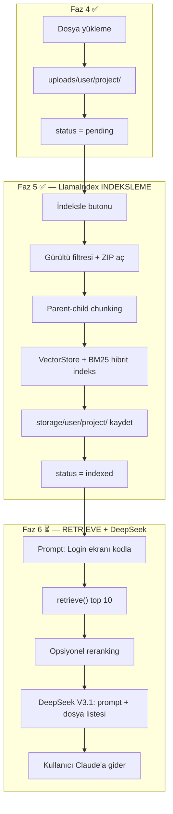

# ContextCraft — Cursor Proje Rehberi

## Proje Özeti

**ContextCraft**, yazılımcıların projelerini yükleyip **LlamaIndex** ile indeksleyen; ardından **DeepSeek V3.1** (OpenRouter) ile kullanıcının kısa isteğini **detaylandırılmış, dış AI araçlarına (Claude, ChatGPT) uyumlu bir prompt** haline getiren ve **yalnızca gerekli dosyaları** seçen bir token optimizasyon platformudur.

> **Önemli:** ContextCraft bir sohbet uygulaması **değildir**. Kullanıcı burada AI ile konuşmaz; sistem prompt üretir ve hangi dosyaların yeterli olduğunu söyler. Asıl kodlama Claude / ChatGPT gibi araçlarda yapılır.

> **Önemli:** Hiçbir AI modeli **yerel indirilmez**. Embedding ve LLM istekleri yalnızca **OpenRouter API** üzerinden gider.

### Örnek Akış (hedef — Faz 6+8 tamamlanınca)

```
Kullanıcı yazar:  "Login ekranı kodla"
         ↓
LlamaIndex:       Hibrit arama ile ilgili dosya/parçaları bulur (Faz 5 ✅)
         ↓
DeepSeek V3.1:    Bulunan parçaları değerlendirir (Faz 6 ⏳)
         ↓
Sistem çıktısı:
  1) Detaylandırılmış prompt  →  Claude'a yapıştırılacak metin
  2) Gerekli dosyalar         →  "Claude'a app/auth/routes.py ve login.html atman yeterli"
```

- **Ders:** İnternet Programcılığı (Meslek Yüksek Okulu)
- **Framework:** Flask 3.x
- **Python:** 3.9 (sistem Python — Mac uyumluluğu için)
- **Veritabanı:** SQLite (geliştirme)
- **Bağlam Motoru:** LlamaIndex 0.11.x (indeksleme + hibrit retrieval)
- **Prompt Değerlendirici:** OpenRouter → DeepSeek V3.1 (`deepseek/deepseek-chat-v3.1`)
- **Embedding:** OpenRouter → `text-embedding-3-small` (API üzerinden)
- **Hedef dış AI araçları:** Claude, ChatGPT

---

## Şu An Hangi Aşamadayız?

**Faz 5 tamamlandı ve test edildi — sırada Faz 6 + Faz 8**

| Bölüm | Durum |
|---|---|
| Faz 1–3: İskelet, DB, Auth | ✅ Tamamlandı |
| Faz 4: Proje yönetimi | ✅ Tamamlandı |
| Faz 5: LlamaIndex indeksleme | ✅ Tamamlandı (test edildi) |
| Faz 6: Prompt optimizasyon (DeepSeek V3.1) | ⏳ Sırada |
| Faz 7: `openrouter.py` altyapısı | ✅ Hazır (entegrasyon Faz 6'da) |
| Faz 8: Prompt arayüzü | ⏳ Faz 6 ile birlikte yapılacak |
| Faz 9: UI & teslim | ⏳ Bekliyor |

**Kullanıcı şu an ne yapabilir?**
- Kayıt / giriş ✅
- Proje oluşturma, dosya yükleme ✅
- Proje indeksleme ✅ (`status = indexed`)
- Prompt yazma ve sonuç alma ❌ (Faz 6+8 henüz yok)

---

## Bu Oturumda Yapılanlar (Mayıs 2026)

### 1. Model kararları kilitlendi ✅

| Konu | Karar | Değer |
|---|---|---|
| **Embedding** (Faz 5) | OpenRouter API — yerel model yok | `text-embedding-3-small` |
| **DeepSeek LLM** (Faz 6) | DeepSeek V3.1 | `deepseek/deepseek-chat-v3.1` |
| **Reranking** (Faz 6) | Opsiyonel, varsayılan kapalı | `RERANK_ENABLED=false` |
| **Retrieve aday sayısı** | Hibrit retrieve → top 10 | rerank açıksa → top 5 |

### 2. Faz 5 kodlandı ✅

Yeni dosyalar:
- `app/utils/index_helpers.py` — gürültü filtresi, ZIP açma, `storage/` yardımcıları
- `app/services/llamaindex_service.py` — indeksleme, hibrit retrieve

Güncellenen dosyalar:
- `app/core/routes.py` — `POST /projects/<id>/index`, silmede storage temizliği
- `app/templates/core/project_detail.html` — İndeksle / Yeniden İndeksle butonu
- `app/templates/base.html` — status badge renkleri
- `config.py`, `.env.example`, `requirements.txt`

### 3. Bilinen hatalar ve düzeltmeler ✅

| Hata | Sebep | Çözüm |
|---|---|---|
| `hashlib.scrypt` yok (kayıt) | Werkzeug 3 varsayılanı scrypt; macOS Python 3.9 LibreSSL desteklemiyor | `user.py`: `method="pbkdf2:sha256"` (hâlâ werkzeug hash) |
| İndeksleme patlıyor | `.env`'de `openai/text-embedding-3-small` — LlamaIndex enum tanımıyor | `_normalize_embedding_model()` ile `text-embedding-3-small`'a çevir |
| LlamaIndex import hatası | llama-index 0.14 Python 3.10+ gerektirir | `requirements.txt`: `llama-index>=0.11.23,<0.12.0` |

### 4. Test sonuçları ✅

- Kayıt/giriş: pbkdf2 düzeltmesi sonrası çalışıyor
- İndeksleme: 8 dosyalı test projesi → 28 node, `status = indexed`
- Embedding: OpenRouter API üzerinden 1536 boyutlu vektör döndü

---

## Faz 5 — LlamaIndex İndeksleme ✅

### Akış

```
uploads/{user_id}/{project_id}/
    ↓
1. Gürültü filtresi (venv, __pycache__, node_modules atla)
2. ZIP aç → _extracted/{zip_adı}/ (orijinal zip kalır)
3. Parent-child chunking
   Parent  → dosya tamamı (max 12000 karakter)
   Child   → Python: ast ile fonksiyon/sınıf; diğer: 80 satırlık bloklar
4. Metadata: file_path, symbol_name, start_line, end_line, file_type, chunk_type
5. VectorStoreIndex  ─┐
   BM25Retriever     ─┤→ QueryFusionRetriever (reciprocal_rerank)
6. storage/{user_id}/{project_id}/ persist + contextcraft_meta.json
7. status = indexed
```

### Adım tablosu

| # | Adım | Dosya | Durum |
|---|---|---|---|
| 5.1 | Gürültü filtresi + ZIP açma + storage yardımcıları | `index_helpers.py` | ✅ |
| 5.2 | OpenRouter embedding (OpenAIEmbedding + api_base) | `llamaindex_service.py` | ✅ |
| 5.3 | Parent-child chunking + metadata | `llamaindex_service.py` | ✅ |
| 5.4 | Hibrit indeks build | `build_project_index()` | ✅ |
| 5.5 | `retrieve(project, prompt, top_k=10)` | `llamaindex_service.py` | ✅ |
| 5.6 | UI: İndeksle butonu + status | `routes.py`, `project_detail.html` | ✅ |
| 5.7 | Silme / yeniden indeksleme storage temizliği | `routes.py`, `index_helpers.py` | ✅ |

### Status değerleri

`pending` → `indexing` → `indexed` / `failed`

### Önemli fonksiyonlar

```python
# app/services/llamaindex_service.py
build_project_index(project)  # indeksler, node sayısı döner
retrieve(project, prompt)     # top 10 aday listesi — Faz 6'da kullanılacak
IndexBuildError                 # bilinen hatalar (API key yok, dosya yok vb.)
```

### retrieve() çıktı formatı

```python
[
  {
    "score": 0.85,
    "text": "...",
    "file_path": "app/auth/routes.py",
    "symbol_name": "login",
    "start_line": 12,
    "end_line": 28,
    "file_type": "py",
    "chunk_type": "child"
  },
  ...
]
```

---

## Faz 6 — Prompt Optimizasyon Motoru ⏳ (SIRADA)

```
"Login ekranı kodla"
    ↓
retrieve(project, prompt) → top 10 aday  ← backend hazır ✅
    ↓
(opsiyonel reranking → top 5)   ← RERANK_ENABLED=false
    ↓
DeepSeek V3.1 → detaylı prompt + dosya listesi
    ↓
{ optimized_prompt, required_files, explanation }
```

| # | Adım | Durum |
|---|---|---|
| 6.1 | `prompt_optimizer.py` — orkestrasyon | ⏳ |
| 6.2 | retrieve → DeepSeek V3.1 | ⏳ |
| 6.3 | Detaylandırılmış prompt üretme | ⏳ |
| 6.4 | Gerekli dosya listesi üretme | ⏳ |
| 6.5 | Çıktı: `{ optimized_prompt, required_files, explanation }` | ⏳ |
| 6.6 | Opsiyonel reranking | ✅ Karar kilitlendi |
| 6.7 | DeepSeek V3.1 | ✅ Karar kilitlendi |

---

## Faz 7 — DeepSeek Altyapısı ✅

| # | Adım | Durum |
|---|---|---|
| 7.1 | `app/services/openrouter.py` — `DeepSeekClient` | ✅ |
| 7.2 | `config.py` + `.env` OpenRouter ayarları | ✅ |
| 7.3 | `get_deepseek_client()` factory | ✅ |
| 7.4 | Prompt optimizer'a entegrasyon | ⏳ Faz 6 |

---

## Faz 8 — Prompt Arayüzü ⏳

| # | Adım | Durum |
|---|---|---|
| 8.1 | Proje detayında prompt giriş formu | ⏳ |
| 8.2 | Sonuç ekranı: detaylandırılmış prompt (kopyala) | ⏳ |
| 8.3 | Gerekli dosya listesi + açıklama | ⏳ |
| 8.4 | Token tasarrufu bilgisi | ⏳ |

> Sohbet arayüzü **yapılmayacak**.

---

## Faz 9 — Arayüz & Teslim ⏳

| # | Adım | Durum |
|---|---|---|
| 9.1 | Bootstrap veya Tailwind | ⏳ |
| 9.2 | Responsive dashboard | ⏳ |
| 9.3 | Birim testleri | ⏳ |
| 9.4 | Production config + sunum dokümantasyonu | ⏳ |

---

## Sistem Mimarisi



### Rol dağılımı

| Bileşen | Ne zaman | Ne yapar |
|---|---|---|
| **Flask (core)** | Faz 4 | Dosyaları diske kaydeder |
| **LlamaIndex** | Faz 5 ✅ | İndeksler (bir kez, OpenRouter embedding) |
| **LlamaIndex** | Faz 6 | `retrieve()` — ilgili parçaları getirir |
| **DeepSeek V3.1** | Faz 6 | Parçaları okuyup detaylı prompt + dosya seçimi yazar |
| **Claude/ChatGPT** | Dışarıda | Asıl kodlama |

---

## Klasör Yapısı (güncel)

```
ContextCraft/
├── app/
│   ├── auth/                      ✅
│   ├── core/
│   │   ├── forms.py               ✅ ProjectForm
│   │   └── routes.py              ✅ proje CRUD + index route
│   ├── main/                      ✅
│   ├── models/
│   │   ├── user.py                ✅ pbkdf2:sha256 hash
│   │   └── project.py             ✅
│   ├── services/
│   │   ├── openrouter.py          ✅ DeepSeekClient
│   │   ├── llamaindex_service.py  ✅ Faz 5
│   │   └── prompt_optimizer.py    ⏳ Faz 6
│   ├── templates/core/
│   │   ├── project_form.html      ✅
│   │   ├── project_list.html      ✅
│   │   └── project_detail.html    ✅ İndeksle butonu
│   └── utils/
│       ├── file_helpers.py        ✅
│       └── index_helpers.py       ✅ Faz 5
├── uploads/                       gitignore
├── storage/                       gitignore — indeks dosyaları
├── config.py
├── cursor.md
├── run.py
├── .env                           gitignore — API anahtarları
└── .env.example
```

---

## Ortam Değişkenleri

```env
# Faz 5 — LlamaIndex embedding (OpenRouter API key)
LLAMAINDEX_API_KEY=
LLAMAINDEX_API_BASE=https://openrouter.ai/api/v1
LLAMAINDEX_EMBEDDING_MODEL=text-embedding-3-small

# Faz 6 — DeepSeek V3.1
OPENROUTER_API_KEY=
OPENROUTER_MODEL=deepseek/deepseek-chat-v3.1
OPENROUTER_SITE_URL=http://localhost:5000
OPENROUTER_APP_NAME=ContextCraft

# Opsiyonel
RERANK_ENABLED=false
# MAX_CONTENT_LENGTH=
```

> `.env` dosyası `.gitignore`'da — **GitHub'a asla gitmez.**
>
> **Not:** `.env`'de `openai/text-embedding-3-small` yazılı olsa bile kod otomatik olarak `text-embedding-3-small`'a çevirir (LlamaIndex uyumu).

---

## Uygulamayı Çalıştırma

```bash
cd ContextCraft
source venv/bin/activate
pip install -r requirements.txt        # ilk kurulum
cp .env.example .env                 # API key'leri doldur
flask db upgrade                     # ilk kurulum
python run.py
```

Tarayıcı: http://127.0.0.1:5000

---

## Mevcut Rotalar

| URL | Method | Açıklama |
|---|---|---|
| `/` | GET | Anasayfa |
| `/auth/register` | GET/POST | Kayıt ol |
| `/auth/login` | GET/POST | Giriş yap |
| `/auth/logout` | GET | Çıkış yap |
| `/core/projects` | GET | Proje listesi |
| `/core/projects/new` | GET/POST | Yeni proje |
| `/core/projects/<id>` | GET | Proje detay |
| `/core/projects/<id>/index` | POST | İndeksle / yeniden indeksle |
| `/core/projects/<id>/delete` | POST | Proje sil |

---

## Kodlama Kuralları (Cursor için)

### Python sürümü
- Hedef: **Python 3.9** — `str | None` kullanma, `Optional[str]` kullan
- LlamaIndex: **0.11.x** kullan (0.14 Python 3.9'da çalışmaz)

### Mimari
- LlamaIndex → `llamaindex_service.py`
- DeepSeek → `openrouter.py`
- Orkestrasyon → `prompt_optimizer.py` (Faz 6)
- İndeks yardımcıları → `index_helpers.py`
- **Onaysız AI/model/embedding ekleme**
- **Yerel model indirme yok** — tüm AI OpenRouter API

### Güvenlik
- API anahtarları yalnızca `.env`'de
- `secure_filename`, path traversal koruması, CSRF aktif
- Şifre hash: `werkzeug.security.generate_password_hash(method="pbkdf2:sha256")`

### İş akışı
- Büyük değişikliklerde önce **plan göster**, onay al, sonra kod yaz
- Her faz adım adım, ayrı onay

---

## Bağımlılıklar (requirements.txt özeti)

```
flask>=3.0,<4.0
llama-index>=0.11.23,<0.12.0          # Python 3.9 uyumu
llama-index-embeddings-openai>=0.2,<0.3
llama-index-retrievers-bm25>=0.4,<0.5
rank-bm25>=0.2.2,<0.3
openai>=1.0,<2.0
werkzeug>=3.0,<4.0
```

---

## Yeni Sohbet İçin Başlangıç Promptu

```
ContextCraft projesinde Faz 6 + Faz 8'e devam ediyorum.
cursor.md dosyasını oku.

Durum:
- Faz 5 (LlamaIndex indeksleme) tamamlandı ve test edildi.
- retrieve() backend'de hazır.
- Prompt arayüzü ve prompt_optimizer.py henüz yok.

Hedef:
- Faz 6: prompt_optimizer.py — retrieve → DeepSeek V3.1 → { optimized_prompt, required_files, explanation }
- Faz 8: proje detay sayfasına prompt formu + sonuç ekranı

Kısıtlar:
- Yerel AI modeli indirme yok, OpenRouter API kullan.
- Python 3.9, onaysız model ekleme.
- Önce plan göster, onay al, sonra kodla.
```
