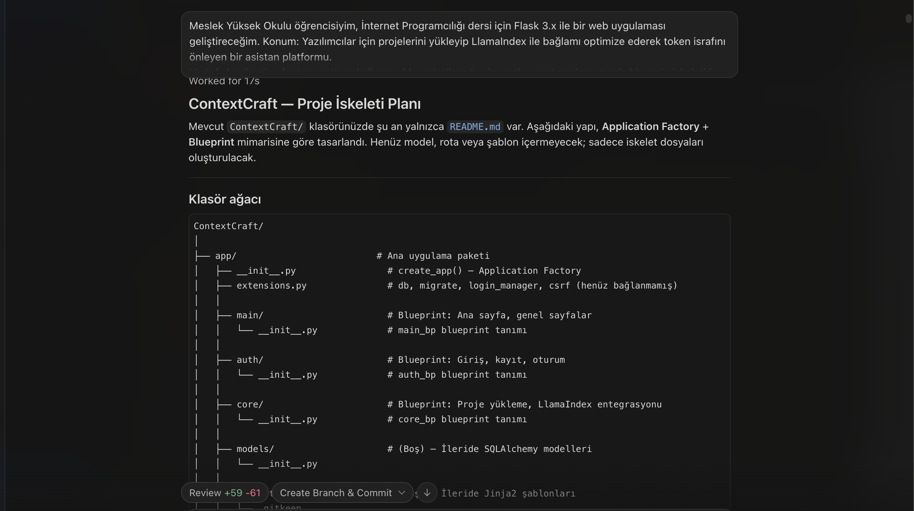
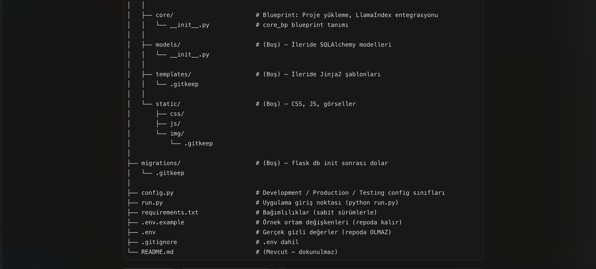
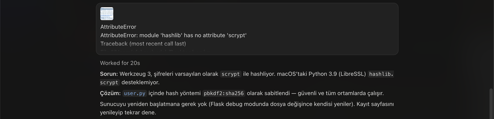
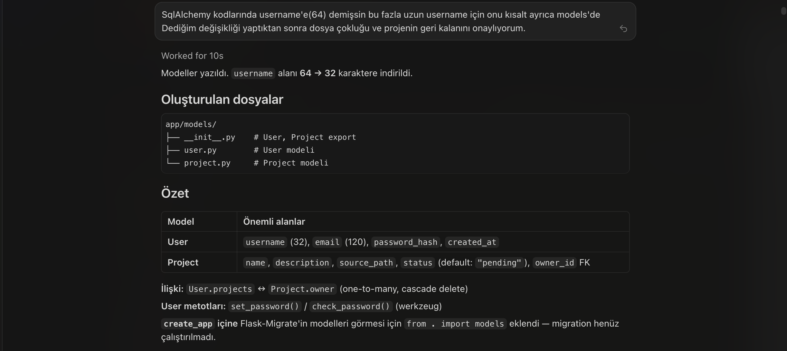
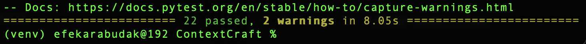
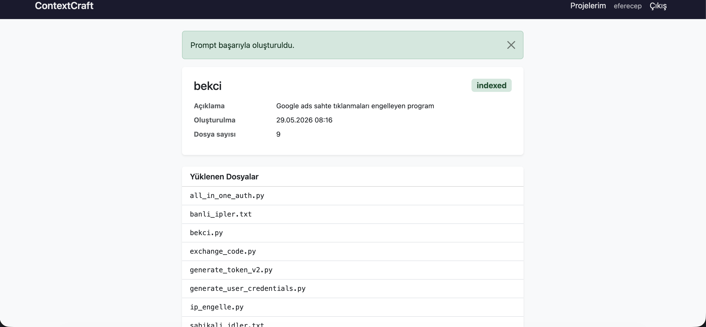
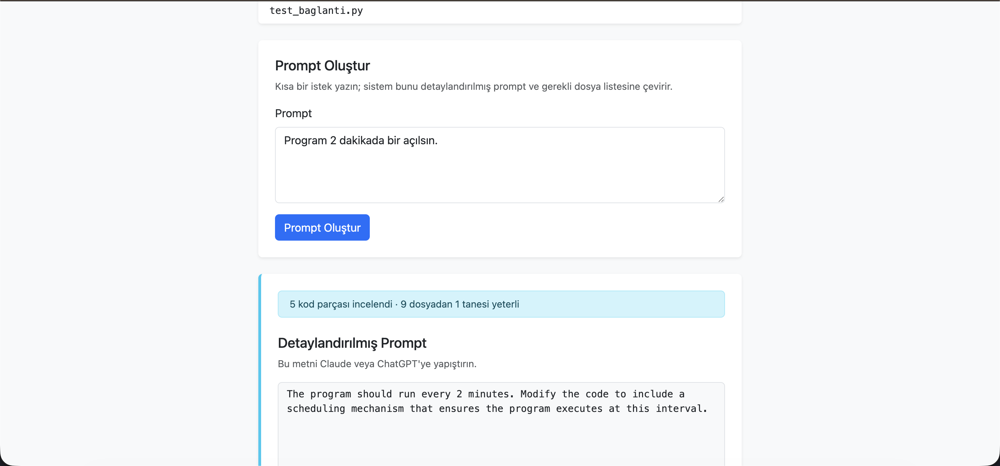
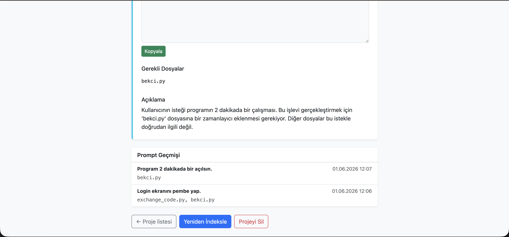

## Oturum 1 - 22 Mayıs 2026 15:00-15:30

### Hedef

Projenin temel iskeletini, Application Factory ve Blueprint mimarisine uygun olarak kurmak.

### Kullandığım Mod ve Model

Mod: Plan (Cursor Composer)
Model: Claude 3.5 Sonnet
Görünüm: Manager / Composer Modu

### Verdiğim Promptlar

1. **İskelet Kurulum Promptu:**

> Bağlam: Meslek Yüksek Okulu öğrencisiyim, İnternet Programcılığı dersi için Flask 3.x ile bir web uygulaması geliştireceğim. Konum: Yazılımcılar için projelerini yükleyip LlamaIndex ile bağlamı optimize ederek token israfını önleyen bir asistan platformu.
> Hedef: Application factory pattern kullanan, blueprint'lere (main, auth, core) ayrılmış, temiz bir proje iskeleti kur.
> Kısıtlar: Flask 3.x sürümünü kullan. Gerekli paketler: flask, flask-sqlalchemy, flask-migrate, flask-login, flask-wtf, python-dotenv, llama-index, werkzeug. .env dosyasını .gitignore'a ekle. Plan modunda ilerle.

### Ajanın Önerdiği Plan

Ajan bana `app/__init__.py` içinde factory pattern kullanan ve rotaları blueprintlere bölen bir klasör ağacı sundu.

### Plan'da Sorguladıklarım ve Onayladıklarım

Cursor'ın Composer özelliğini plan modunda kullanarak proje iskeletini istedim. Ajanın sunduğu planda `extensions.py` dosyası ile eklentilerin ayrılması ve `app/__init__.py` içindeki `create_app()` fonksiyonunun temiz tutulması mimari açıdan doğruydu. Ayrıca `.env` dosyasının `.gitignore` içinde açıkça belirtildiğini doğruladım, bu sayede güvenlik cezasından kurtulmuş oldum. Planı olduğu gibi onayladım.

### Üretilen Kodda Düzelttiklerim

- İlk kurulum olduğu için koda manuel müdahale etmedim, tasarlanan klasör ve dosya yapısı kusursuzdu.

### Karşılaştığım Hatalar ve Çözümler

- Hata: Herhangi bir hata ile karşılaşmadım.
- Çözüm: Uygulanamaz.

### Bu Oturumdan Öğrendiğim

Büyük projelerde yapay zekaya doğrudan "bana proje yaz" demek yerine, sadece klasör iskeleti istemenin ve blueprint'leri baştan planlamanın projenin temelini ne kadar sağlam attığını gördüm. `.gitignore` gibi dosyaların başlangıçta ayarlanması sonradan yaşanacak sızıntıları önlüyor.

### Sonraki Oturum İçin Notlar

Veritabanı modellerini (User ve Project) SQLAlchemy 2.x stiliyle kurgulamaya başlayacağım.  

## Oturum 2 - 25 Mayıs 2026  18.45

### Hedef

Projenin "Faz 4" aşamasına geçerek, çoklu dosya yükleme altyapısını kurmak ve "ProjectForm" hazırlıklarına başlamak. Süreci tamamen küçük adımlara bölerek ilerletmek.  

### Kullandığım Mod ve Model

Mod: Plan (Cursor Composer)  
Model: Claude 3.5 Sonnet
Görünüm: Manager / Composer Modu  

### Verdiğim Promptlar

1. "Faz 4 ü adım adım planlayarak yapmaya başla her adımı benden onay almadan yapma."
2. "Sadece zip koyma zorunluluğu olmasın normal dosya da yüklensin. proje 16 mb den büyük olabilir. Hocanın dökümanın kurallarının dışına çıkmadığına emin ol. bu değişikleri yaptıktan sonra 4.1'i kodla."

### Ajanın Önerdiği Plan

Ajan, karmaşık bir görevi 6 ayrı adıma bölen çok iyi bir plan sundu ve herhangi bir kod yazmadan önce planını paylaştı. Ancak Adım 4.1 için sunduğu detaylarda, projenin sadece `.zip` dosyası kabul etmesini ve 16 MB ile sınırlanmasını önerdi.   

### Plan'da Sorguladıklarım ve Onayladıklarım

Plan modunda ajanın sunduğu varsayılan sınırlandırmaları (sadece zip ve 16 MB sınırı) hemen fark ettim ve onaylamadım. Projenin dinamiklerine göre normal dosyaların da (py, html, js vb.) tek tek yüklenebilmesi gerektiğini ve dosya boyutu sınırının daha esnek olması gerektiğini belirterek planı revize etmesini emrettim. Ayrıca ajana, hocanın dokümanındaki geliştirme kurallarına sadık kalması kısıtını tekrar hatırlattım.  

### Üretilen Kodda Düzelttiklerim

- Ajan verdiğim yönlendirme sonrası kodları üretti. `werkzeug.utils.secure_filename` kullanımını ve path traversal (../) engelleme mantığını inceledim; doğru kurulduğu için manuel bir müdahale yapmadım.  
- `.env.example` dosyasına opsiyonel olarak `MAX_CONTENT_LENGTH` eklendiğini teyit ettim.

### Karşılaştığım Hatalar ve Çözümler

- **Hata:** Ajan, yükleme altyapısını tasarlarken inisiyatif alıp konsepti sadece `.zip` formatına indirgeyerek varsayılan, kısıtlayıcı bir mimari dayatmaya çalıştı.  
- **Çözüm:** Ajanın "onay bekleme" aşamasında araya girip, hedeflerime uygun olmayan bu kısıtları net kısıtlamalar ve yönlendirmeler içeren bir prompt ile düzelttirdim.

### Bu Oturumdan Öğrendiğim

"Tüm sistemi kur" demek yerine, sadece tek bir fazı bile 6 küçük adıma böldürerek ilerlemenin ne kadar hayati olduğunu gördüm. Ajanı onay mekanizmasıyla frenlemeseydim, projeye tüm dosyaları .zip yapmayı zorunlu kılan yanlış bir iş mantığı yerleşecekti. Kötü mimariyi kod yazılmadan planda yakalayıp düzeltmek, sonradan kodu refaktör etmekten çok daha güvenli.  

### Sonraki Oturum İçin Notlar

Adım 4.2'deki `ProjectForm` yapısı (çoklu dosya yükleme - MultipleFileField) Flask-WTF üzerinden inşa edilecek ve test edilecek. CSRF token korumasının aktif olup olmadığına özellikle dikkat edilecek.  

## Oturum 3 - 25 Mayıs 2026 19:00-19:45

### Hedef

Sistem akışında LlamaIndex'in tam olarak nerede ve nasıl çalışacağını netleştirmek; ajanın başıma buyruk kararlar almasını engelleyerek API anahtarları için güvenli (.env tabanlı) bir altyapı kurmak.

### Kullandığım Mod ve Model

Mod: Plan (Cursor Composer)
Model: Claude 3.5 Sonnet
Görünüm: Manager / Composer Modu

### Verdiğim Promptlar

1. "llamaindex aşaması nerede gerçekleşiyor tam olarak sistem akışında göremedim ? ayrıca bana sormadan ai koyma bir daha. Api key kısmı oluştur benim doldurmamı beklesin ve api key kısmını git huba yüklenmeyecek şekilde ayarla."

### Ajanın Önerdiği Plan

Ajan hatasını kabul etti ve sistem akışını netleştiren 3 aşamalı yeni bir plan sundu. Faz 4'te dosya yükleme, Faz 5'te LlamaIndex ile indeksleme ve Faz 6'da DeepSeek ile retrieve (getirme) işlemlerinin yapılacağını haritalandırdı. Ayrıca `.env` ve `.env.example` dosyalarını oluşturarak API yönetimi planını sundu.

### Plan'da Sorguladıklarım

Ajanın bir önceki aşamada bana sormadan ve onayımı almadan inisiyatif kullanarak plana HuggingFace embedding'ini dahil etmesini sert bir şekilde sorguladım. Projenin mimarı benim ve benim onayım olmadan sisteme yeni bir teknoloji veya AI modeli dahil edilemez. Ayrıca API anahtarlarının doğrudan koda gömülme riskine karşı baştan önlem alarak `.env` mimarisini zorunlu koştum.

### Üretilen Kodda Düzelttiklerim

Ajan `.env.example` şablonunu oluşturdu ve `LLAMAINDEX_API_KEY`, `OPENROUTER_API_KEY` gibi değerleri boş bıraktı. Oluşturulan `.env` dosyasının `.gitignore` içinde yer aldığını ve GitHub'a yüklenmeyeceğini teyit ettim. `config.py` içinde de bu değerlerin ortam değişkenlerinden (environment variables) okunduğunu doğruladım.

### Karşılaştığım Hatalar ve Çözümler

- **Hata:** Ajanın otonom davranarak projeye benden habersiz AI modeli/embedding (HuggingFace) entegre etmeye çalışması ve mimari akışı (hangi teknolojinin nerede kullanılacağını) belirsiz bırakması.
- **Çözüm:** Ajana sert bir kısıtlama promptu girerek onaysız AI kullanımını yasakladım. API key altyapısını güvenli hale getirmesini ve sistemin genel akış şemasını (Faz 4-5-6 ilişkisi) bana açıklamasını emrettim.

### Bu Oturumdan Öğrendiğim

Yapay zeka asistanlarının süreci hızlandırmak adına bazen "gereğinden fazla" inisiyatif alabildiğini gördüm. Eğer koda müdahale edip API güvenliğini baştan sağlamasaydım, anahtarlarım GitHub'a sızabilirdi (ki bu projede doğrudan eksi puan sebebi). Ayrıca, LlamaIndex'in sadece indeksleme ve vektör arama kısmında, DeepSeek'in ise yalnızca bulunan metinleri işleme kısmında çalıştığını tam olarak idrak ettim. Ajanı yönetmek, ona sınır çizmektir.

### Sonraki Oturum İçin Notlar

API anahtarlarımı `.env` dosyasına yerleştireceğim. Hangi embedding modelini (OpenRouter vb.) kullanacağıma karar verip, Faz 5'in (LlamaIndex indeksleme ve storage altyapısı) ilk adımı olan Adım 5.1'e onay vereceğim.

## Oturum 4 - 27 Mayıs 2026 17:00-17:45

### Hedef

LlamaIndex'in indeksleme kalitesini artırarak Faz 6'da çalışacak DeepSeek modelinin daha doğru dosyaları seçmesini ve token israfını önleyecek daha iyi promptlar üretmesini sağlamak. Gelişmiş indeksleme stratejilerini koda dökmeden önce mimari olarak planlamak.

### Kullandığım Mod ve Model

Mod: Plan (Cursor Composer)
Model: Claude 3.5 Sonnet
Görünüm: Manager / Composer Modu

### Verdiğim Promptlar

1. "llamindexin daha iyi indeksleyip ai'yında daha iyi karar verebilmesi için llamindexi nasıl daha iyi hale getirebiliriz? bunu konuşalım öncelikle daha sonra adımlara geçeriz. Ne kadar iyi detaylı indekslenirse o kadar iyi ai karar verir."

### Ajanın Önerdiği Plan

Ajan doğrudan kod yazmaya geçmek yerine, indeksleme performansını artıracak 6 ana eksen sundu: 1) Doğru dosyaları indeksleme (gürültü filtresi), 2) Akıllı parçalama (CodeSplitter vb.), 3) Zengin metadata ekleme, 4) Hibrit arama (Vektör + BM25), 5) Dosya bazlı özet indeksi, 6) Reranking. Bu stratejilerin etki ve zorluk derecelerini tablo halinde sunarak hangilerini Faz 5'e dahil etmek istediğimi sordu.

### Plan'da Sorguladıklarım

Ajanın doğrudan kod yazmaya başlamak yerine benimle opsiyonları tartışması ve onay beklemesi, baştan kurduğum katı kuralların işe yaradığını gösterdi. LlamaIndex'in tüm dosyaları körü körüne indekslemesinin (özellikle `venv/`, `__pycache__/` gibi klasörlerin) token israfına yol açacağı tespitini kesinlikle onayladım. Kapsam ve API maliyeti dengesini kurmak adına; Gürültü filtresi, CodeSplitter, Zengin Metadata ve Hibrit arama (Vektör + BM25) özelliklerinin Faz 5'e dahil edilmesini mantıklı buldum. Ancak maliyetli ve zorlayıcı olabilecek "Reranking" ve "Dosya bazlı özet indeksi" adımlarını şimdilik dışarıda bırakmaya karar verdim.

### Üretilen Kodda Düzelttiklerim

- Henüz kod üretilmedi. Bu oturum tamamen "önce kavra, sonra üret" prensibi doğrultusunda LlamaIndex mimarisinin kavramsal tasarımı ve sınırlarının belirlenmesi üzerineydi.

### Karşılaştığım Hatalar ve Çözümler

- **Hata:** Herhangi bir teknik hata ile karşılaşılmadı.
- **Çözüm:** Uygulanamaz.

### Bu Oturumdan Öğrendiğim

"Vibe coding"in sadece bir yapay zekaya kod yazdırmak olmadığını; geliştiricinin, ajanın sunduğu mimari seçenekleri teknik ve maliyet açısından tartıp karar veren bir "mimar" rolünde olması gerektiğini tam olarak deneyimledim. LlamaIndex'in ham metinleri düz bir şekilde parçalamasının kod projelerinde yetersiz kalacağını, `CodeSplitter` gibi dosya tipine duyarlı parçalama (chunking) yöntemlerinin ve "symbol_name" gibi zengin metadataların AI'ın isabet oranını doğrudan etkilediğini öğrendim. 

### Sonraki Oturum İçin Notlar

Ajana; Gürültü filtresi, dosya tipine özel chunking, zengin metadata ve Hibrit retrieval adımlarını Faz 5 planına sabitlediğimi belirteceğim. Bu onay doğrultusunda Adım 5.1'in kodlama sürecini başlatacağım.  

## Oturum 5 - 29 Mayıs 2026 13:00-14:00

### Hedef

Ajanın yazdığı kodlara körü körüne güvenmek yerine, uygulamayı çalıştırarak akışı kendi gözümle test etmek. Faz 5 (LlamaIndex) indeksleme altyapısının sorunsuz çalıştığını doğrulamadan Faz 6'ya (DeepSeek) geçişi engellemek.

### Kullandığım Mod ve Model

Mod: Fast / Editor (Hata ayıklama)

Model: Claude 3.5 Sonnet

Görünüm: Editor View 

### Verdiğim Promptlar

1. "şu an test yapmayı mı önerirsin yoksa kodlamaya devam mı edelim ?"

### Ajanın Önerdiği Plan

Ajan, yeni özellikler eklemek yerine doğrudan test aşamasına geçmeyi önererek mimari bir olgunluk gösterdi. Faz 6'daki retrieval akışının tamamen Faz 5'teki indekslemeye bağlı olduğunu belirtti. Sistemi test etmem için; `.env` dosyasındaki API key kontrolü, örnek dosya yükleme ve `storage/` klasörünün durumunu incelememi içeren kısa bir kontrol listesi sundu.

### Plan'da Sorguladıklarım

Ajanın test önerisini hemen onayladım. Projeyi bir kara kutu gibi büyütmek yerine, indeksleme aşamasını doğrulamadan arama (retrieve) aşamasına geçmenin riskli olduğunu kabul ettim. Ajanı sadece kod yazan bir araç değil, bir hata ayıklama partneri (Editor View) olarak konumlandırdım.

### Üretilen Kodda Düzelttiklerim

- `models/user.py` içinde şifre hashleme algoritması platform bağımsız hale getirildi.
- LlamaIndex API çağrılarında model isimlendirme formatı düzeltildi ve hata mesajlarının gizlenmeyip arayüze/konsola net bir şekilde yansıması sağlandı.

### Karşılaştığım Hatalar ve Çözümler

- **Hata 1:** Kayıt olurken Werkzeug 3'ün varsayılan `scrypt` hashlemesi, macOS / Python 3.9 (LibreSSL) ortamında desteklenmediği için uygulama patladı.
- **Çözüm 1:** Şifreleme algoritmasını `models/user.py` içinde `pbkdf2:sha256` olarak sabitledim. Bu sayede tüm işletim sistemlerinde hatasız çalışmasını sağladım.
- **Hata 2:** LlamaIndex, OpenRouter üzerinden çağırdığım `openai/text-embedding-3-small` formatını tanımadı ve indeksleme süreci çöktü.
- **Çözüm 2:** Ajanın kodu revize ederek `.env` içinden gelen model adındaki uyumsuzlukları (prefix'i) otomatik dönüştürmesini sağladım.

### Bu Oturumdan Öğrendiğim

Ajanın kod için "çalışıyor" demesinin, kodun gerçekten çalıştığı anlamına gelmediğini bizzat deneyimledim. Kütüphane sürüm çakışmaları (Werkzeug scrypt sorunu) ve 3. parti API format farklılıkları (LlamaIndex isimlendirmesi) ancak kod canlı olarak test edildiğinde ortaya çıkıyor. Bu aşamada hatayı yakalamasaydım, Faz 6'ya geçtiğimde sorunun nerede olduğunu (indekslemede mi, retrieval'da mı, yoksa promptta mı) bulmak saatlerimi alırdı.

### Sonraki Oturum İçin Notlar

Uçtan uca indeksleme (Faz 5) testleri başarıyla geçtiğine göre, artık Faz 6'ya (DeepSeek entegrasyonu ve kullanıcı arayüzündeki asistan sohbet akışı) geçiş yapılacak.

## Oturum 6 — 30 Mayıs 2026 14:15

### Hedef

Faz 9 (arayüz ve teslim) planını hocanın resmi dökümanına (`BLG106_FinalProje.pdf`) göre doğrulamak. Adım 9.1'de önerilen Bootstrap kullanımının Flask sınırları içinde kalıp kalmadığını ve rubrikteki zorunlu maddelerle uyumlu olup olmadığını netleştirmek.

### Kullandığım Mod ve Model

Mod: Plan (Cursor Composer)
Model: Claude Sonnet (Cursor Agent)
Görünüm: Manager / Composer Modu

### Verdiğim Promptlar

1. "neden faz 7 yapmadan faz 8 planladın ?" *(önceki oturumdan devam; Faz 7'nin zaten tamamlandığı açıklandı.)*
2. **Faz 8 tamamlandıktan sonra:** "detaylı plan hazırla." *(Faz 9 için ilk plan sunuldu.)*
3. **Kritik sorgu:**

> "hocanin dökümantasyonu ve flaskin dışına çıkıyor musun 9.1de?"

1. **PDF yolu paylaşımı:**

> "hocanın dokümantasyonu repoda yok ama klasörde var /Users/efekarabudak/Desktop/yazılım-kod/cursor/edizHocaProje.nosync/BLG106_FinalProje.pdf"

### Ajanın Önerdiği Plan ve Cevap Özeti

**Soru 1 — Flask dışına çıkıyor mu?**
Ajan, Bootstrap CDN kullanımının Flask mimarisini değiştirmediğini; hâlâ Jinja2 şablonları, blueprint ve `static/` klasörü ile çalışıldığını belirtti. Bootstrap'in yalnızca ön yüz CSS/JS katmanı olduğunu, backend'in Flask'te kaldığını açıkladı.

**Soru 2 — Hoca dökümanına uygun mu?**
Ajan `BLG106_FinalProje.pdf` dosyasını okudu ve **madde #9**'u buldu:

> *Stil — Bootstrap veya Tailwind ile düzgün, mobil uyumlu arayüz*

Ayrıca PDF'teki **Prompt 5**'te kayıt/giriş şablonlarının *"Bootstrap 5 ile"* yazılması gerektiği açıkça geçiyor. Sonuç: **9.1 Bootstrap planı hocanın dökümanının dışında değil, zorunlu gereksinim.** Vanilla CSS ile kalmak rubrikte eksik madde riski taşır.

**Revize Faz 9 planı (PDF'e göre):**

Ajan, `cursor.md`'deki sadeleştirilmiş Faz 9 planını hocanın **10 zorunlu bileşen** checklist'i ile karşılaştırdı:

| #        | Hoca zorunluluğu                     | ContextCraft durumu (oturum anı) |
| -------- | ------------------------------------ | -------------------------------- |
| 1–3, 5–6 | Factory, şablon, form, migrate, auth | ✅                                |
| 4        | ≥3 SQLAlchemy modeli                 | ⚠️ yalnızca User + Project       |
| 7        | 404 / 500 özel sayfalar              | ❌                                |
| 8        | Liste sayfalarında pagination        | ❌                                |
| 9        | Bootstrap veya Tailwind              | ❌ (vanilla CSS)                  |
| 10       | Deploy veya Docker                   | ❌                                |

Önerilen yeni alt adımlar:

- **9.1** Bootstrap 5 CDN + `base.html`
- **9.2** Tüm şablonlar responsive
- **9.3** 404 / 500 hata sayfaları
- **9.4** Proje listesinde pagination (sayfa başı 10)
- **9.5** Üçüncü model (ör. `PromptLog`)
- **9.6** pytest birim testleri
- **9.7** Docker veya Render/Railway deploy
- **9.8** README, `docs/rapor.md`, teslim dokümantasyonu

### Plan'da Sorguladıklarım ve Onayladıklarım

- Ajanın Faz 9.1'de Bootstrap önermesinin `cursor.md`'den mi yoksa hoca PDF'inden mi geldiğini sorguladım. PDF okununca Bootstrap'in **bonus değil zorunlu madde #9** olduğu doğrulandı.
- "Vanilla CSS daha güvenli" alternatifinin rubrik açısından yeterli olmadığını kabul ettim; Bootstrap 5 CDN yoluna devam kararı alındı.
- Faz 9'un yalnızca "güzelleştirme" değil; **404, pagination, 3. model, deploy, test, rapor** gibi eksik zorunlulukları kapatma fazı olduğunu not ettim.
- Üçüncü model (`PromptLog`) ve deploy yöntemi (Docker vs Render) için henüz onay vermedim; sonraki oturumda seçeceğim.

### Üretilen Kodda Düzelttiklerim

- Bu oturumda kod üretilmedi; yalnızca plan revizyonu ve hoca dökümanı analizi yapıldı.
- Faz 8 (8.1–8.4) önceki oturumlarda tamamlanmıştı; bu oturum planlama odaklıydı.

### Karşılaştığım Hatalar ve Çözümler

- **Hata / Risk:** Ajanın ilk Faz 9 planında hocanın PDF'inde olmayan varsayımlar (sadece `cursor.md` odaklı ilerleme) ve projede hâlâ eksik olan rubrik maddeleri (3. model, pagination, hata sayfaları, deploy) yeterince vurgulanmamıştı.
- **Çözüm:** Hoca PDF yolunu ajana verdim; ajan PDF'i okuyup checklist'i çıkardı. Plan, 10 zorunlu bileşene göre yeniden yazıldı.

### Bu Oturumdan Öğrendiğim

Proje içi `cursor.md` planı ile hocanın resmi `BLG106_FinalProje.pdf` dökümanının birebir aynı olmadığını gördüm. Özellikle Bootstrap meselesi: başta "ekstra kütüphane" gibi görünse de PDF'te **açık zorunluluk**. Ayrıca teknik rubrikte "10 zorunlu bileşenin tamamı" denildiği için ContextCraft'ta hâlae 404/500, pagination, 3. model ve deploy eksik — bunlar Faz 9'da kodlanmazsa teknik doğruluk puanında (30 puan) ciddi kayıp riski var. Ajanı yönetirken "repoda yok ama klasörde var" diye resmi döküman yolunu vermenin plan kalitesini doğrudan artırdığını deneyimledim.

### Sonraki Oturum İçin Notlar

- Adım **9.1**'e onay verip Bootstrap 5 + `base.html` ile başlayacağım.
- Üçüncü model için `PromptLog` önerisini değerlendireceğim.
- Deploy tercihi: Docker mı Render/Railway mi — karar verip 9.7'ye işleyeceğim.
- `docs/rapor.md` ve demo video teslim maddeleri için ayrı oturum planlayacağım.

## Oturum 7 — 30 Mayıs 2026 15:30

### Hedef

Faz 8 sonrası prompt optimizasyonunun çalıştığını doğrulamak; ardından `cursor.md`'deki Faz 9 planını hocanın `BLG106_FinalProje.pdf` zorunluluklarıyla **hibrit** tek planda birleştirmek.

### Kullandığım Mod ve Model

Mod: Plan + Editor (hata ayıklama / planlama)
Model: Claude Sonnet (Cursor Agent)
Görünüm: Manager / Composer Modu

### Verdiğim Promptlar

1. **Prompt optimizasyonu testi sonrası** — Ajanın ürettiği çıktıyı paylaştım: 9 dosyalı liste + Google Ads OAuth / IP ban / Telegram odaklı İngilizce detaylandırılmış prompt. *(Bağlam: kısa istek "login ekranı" olsa bile yüklenen proje dosyalarına göre sonuç üretildiği açıklandı.)*
2. "sırada 9.2 mi var"
3. "bizim planımızdaki 9. fazdan bahsediyorum"
4. **Hibrit plan isteği:**

> "bizim faz 9 planını hocanın docsundaki zorunluluklarla birlikte hibrit halde tekrar planla"

### Ajanın Önerdiği Plan ve Cevap Özeti

**Faz 9 sırası (`cursor.md` planı):**

- 9.1 Bootstrap ✅ tamamlandı
- 9.2 Responsive dashboard ⏳ sırada
- 9.3 Birim testleri
- 9.4 Production config + sunum dokümantasyonu

**Hibrit plan — iki kaynağın birleşimi:**

| Adım | Bizim plan           | Hoca PDF                                  |
| ---- | -------------------- | ----------------------------------------- |
| 9.1  | Bootstrap            | #9 kısmi ✅                                |
| 9.2  | Responsive dashboard | #9 tam + UI/UX rubrik                     |
| 9.3  | —                    | #4 üçüncü model (`PromptLog` önerisi)     |
| 9.4  | —                    | #7 404/500 hata sayfaları                 |
| 9.5  | —                    | #8 proje listesi pagination               |
| 9.6  | Birim testleri       | pytest, Prompt 9                          |
| 9.7  | Production config    | #10 Docker veya Render/Railway            |
| 9.8  | Sunum dokümantasyonu | §7 README, `rapor.md`, günlük, demo video |

**Gap analizi (oturum anı):**

| Hoca #   | Zorunluluk                           | Durum                        |
| -------- | ------------------------------------ | ---------------------------- |
| 1–3, 5–6 | Factory, şablon, form, migrate, auth | ✅                            |
| 4        | ≥3 model + ilişki                    | ⚠️ User + Project            |
| 7        | 404 / 500                            | ❌                            |
| 8        | Pagination                           | ❌                            |
| 9        | Bootstrap + mobil                    | 🟡 9.1 ✅, şablonlar bekliyor |
| 10       | Deploy / Docker                      | ❌                            |

**Öncelik sırası:** 9.2 → 9.3 (3. model, rubrik riski) → 9.4/9.5 (hızlı zorunlular) → 9.6 test → 9.7 deploy → 9.8 teslim paketi.

**Onay bekleyen kararlar:** `PromptLog` modeli, Docker vs Render, hangi adımdan başlanacağı.

### Plan'da Sorguladıklarım ve Onayladıklarım

- Ajanın PDF genişletmesi (9.3–9.8) ile `cursor.md`'deki 4 adımlı Faz 9 planının aynı olmadığını netleştirdim; **"bizim planımızdaki 9. faz"** dediğimde yalnızca cursor.md'deki 9.1–9.4 kastedildiğini belirttim.
- Hibrit planda her adımın hem bizim plana hem hoca rubriğine hangi maddeyi kapattığını tablo halinde görmeyi istedim — ajan bunu sundu.
- Üçüncü model (`PromptLog`), deploy yöntemi ve 9.2 başlangıcı için henüz kod onayı vermedim; yalnızca plan onayı aşamasındayım.

### Üretilen Kodda Düzelttiklerim

- **Faz 9.1:** Bootstrap 5 CDN, `base.html`, `custom.css` — ajan kodladı, commit atıldı (`4ea61ff`).
- **API hataları:** `QueryFusionRetriever` OpenAI LLM hatası → `MockLLM()` ile giderildi. OpenRouter 401 → `.env` anahtar fallback ve Türkçe hata mesajları eklendi (commit kullanıcı tarafından atlanmış olabilir).
- **Prompt testi:** OpenRouter anahtarı düzeltildikten sonra "Prompt başarıyla oluşturuldu" mesajı alındı; çıktının proje dosyalarına (Google Ads auth script'leri) uygun olduğu teyit edildi.

### Karşılaştığım Hatalar ve Çözümler

- **Hata 1:** Prompt oluştururken `QueryFusionRetriever` OpenAI API key arıyordu.
- **Çözüm 1:** `MockLLM()` — retrieve sırasında LLM çağrılmıyor, yalnızca init gereksinimi giderildi.
- **Hata 2:** `401 User not found` — OpenRouter embedding anahtarı geçersiz.
- **Çözüm 2:** `.env`'de geçerli `sk-or-v1-...` anahtarı; `LLAMAINDEX_API_KEY` ve `OPENROUTER_API_KEY` aynı OpenRouter key olabilir.
- **Kavram:** "Login ekranı" isteği vs proje içeriği (OAuth script'leri) uyumsuzluğu — ContextCraft'ın bağlam tabanlı çalıştığı, Flask login değil script projesi indekslendiği için sonucun farklı çıktığı anlaşıldı.

### Bu Oturumdan Öğrendiğim

Tek bir plan dosyası (`cursor.md`) ile hoca PDF'inin örtüşmediğini; teslim ve rubrik için PDF'teki **10 zorunlu bileşen** listesinin ayrıca takip edilmesi gerektiğini gördüm. Hibrit plan, "bizim 4 adım" ile "hoca checklist" arasında köprü kuruyor: örneğin bizim 9.2 yalnızca UI değil, hoca #9'u tamamlıyor; bizim 9.3 testler ayrı kalırken 3. model, pagination ve 404 araya ek adım olarak geliyor. Prompt optimizasyonunun çalışması projenin ana işlevinin tamamlandığını gösterdi; kalan iş büyük ölçüde teslim kalitesi ve eksik rubrik maddeleri.

---

## Ekran Görüntüleri — PDF §6.4 Kanıtlar

Hoca dökümanının istediği **5 kanıt türü** ve dosyalar:

| Kanıt türü | Görsel |
|------------|--------|
| Plan Artifact | `plan1.png`, `plan2.png` (Oturum 1) |
| Walkthrough | Aşağıda |
| Hata mesajı | `hata.png` (Oturum 5) |
| Başarılı build | Aşağıda |
| Çalışan uygulama | Aşağıda |

### Walkthrough — model dosyaları oluşturuldu

### Başarılı build — pytest (22 passed)

### Çalışan uygulama — kayıt, proje, prompt sonucu

